# BuildPilot — Manual Testing & Learning Guide 🧑‍💻📚

> **Hands-on verification and rapid engineering learning guide for BuildPilot.**
> For each task, this guide breaks down:
> 1. 📂 **Key Files to Study** — Exactly which source files to read to understand the implementation.
> 2. 🔄 **Execution & Data Flow** — How data flows across processes, databases, and layers.
> 3. 💡 **Core Concepts & Why It's Built This Way** — Software design patterns, enterprise tradeoffs, and best practices.
> 4. 🧪 **How to Manually Run & Test** — Copy-pasteable CLI commands and expected outputs.

---

## 📋 Table of Contents

- [Phase 0 — Infrastructure & Monorepo](#phase-0--infrastructure--monorepo)
  - [Task 0.1: Monorepo & Build Toolchain](#task-01-monorepo--scripts)
  - [Task 0.2: Container Infrastructure (MongoDB & Redis)](#task-02-docker-infrastructure-mongodb--redis)
- [Phase 1 — Web Dashboard Shell & Domain Types](#phase-1--web-dashboard-shell--domain-types)
  - [Task 1.1: Next.js Web Dashboard](#task-11-nextjs-web-dashboard)
  - [Task 1.2: Domain Types & Finite State Machine](#task-12-domain-types--state-machine)
- [Phase 2 — Database Layer](#phase-2--database-layer)
  - [Task 2.1: MongoDB Connection Manager](#task-21-mongodb-connection-manager)
  - [Task 2.2: Mongoose Models & Repositories](#task-22-mongoose-models--repositories)
- [Phase 3 — Control API](#phase-3--control-api)
  - [Task 3.1: Express Application Shell & Correlation Tracing](#task-31-express-application-shell)
  - [Task 3.2: Task & Project API (4-Tier Architecture)](#task-32-task--project-api-4-tier-architecture)
- [Phase 4 — Queue + Worker](#phase-4--queue--worker)
  - [Task 4.1: Redis + BullMQ Queue Engine](#task-41-redis--bullmq-queue-setup)
  - [Task 4.2: Worker Service Foundation & State Persistence](#task-42-worker-service-foundation--state-persistence)
- [Phase 5 — LLM Provider Layer](#phase-5--llm-provider-layer)
  - [Task 5.1: Generic Provider Contract & Factory Architecture](#task-51-generic-provider-contract--factory-architecture)
  - [Task 5.2: OpenRouter Provider Adapter & Tool Calling](#task-52-openrouter-provider-adapter--tool-calling)
  - [Task 5.3: OpenAI-Compatible Provider Adapter (Local Ollama, Groq, vLLM)](#task-53-openai-compatible-provider-adapter-local-ollama-groq-vllm)
- [Phase 6 — Agent Runtime](#phase-6--agent-runtime)
  - [Task 6.1: Context Builder & Token Budget Management](#task-61-context-builder--token-budget-management)
  - [Task 6.2: Agent Core Loop with Multi-Step Tool Execution & Persistence](#task-62-agent-core-loop-with-multi-step-tool-execution--persistence)
  - [Task 6.3: Agent Failure Recovery, Transient Retry & Loop Protection](#task-63-agent-failure-recovery-transient-retry--loop-protection)
- [Phase 7 — First Tool Registry](#phase-7--first-tool-registry)
  - [Task 7.1: Typed Tool Framework & Permission Policies](#task-71-typed-tool-framework--permission-policies)
  - [Task 7.2: Repository Tools (`list_files`, `search_code`, `read_file`, `write_file`, `git_status`, `git_diff`)](#task-72-repository-tools-list_files-search_code-read_file-write_file-git_status-git_diff)
  - [Task 7.3: Execution Tools (`run_command`, `run_tests`)](#task-73-execution-tools-run_command-run_tests)
- [Phase 8 — Git Workspace Management](#phase-8--git-workspace-management)
  - [Tasks 8.1, 8.2, 8.3: Repository Mirroring, Isolated Worktrees & Commit/Push Flow](#tasks-81-82-83-repository-mirroring-isolated-worktrees--commitpush-flow)
- [Phase 9 — GitHub App + Automatic Issue Intake](#phase-9--github-app--automatic-issue-intake)
  - [Tasks 9.1, 9.2, 9.3: Webhook Verification, Issue-to-Task Pipeline & GitHub Comments](#tasks-91-92-93-webhook-verification-issue-to-task-pipeline--github-comments)
- [Phase 10 — End-to-End Vertical Slice (MVP)](#phase-10--end-to-end-vertical-slice-mvp-issue--code-fix--tests--pr)
  - [Tasks 10.1 & 10.2: End-to-End Autonomous Pipeline & Demonstration](#tasks-101--102-end-to-end-vertical-slice-integration--benchmark-demo)
- [Phase 11 — Dashboard Connected to Reality](#phase-11--dashboard-connected-to-reality)
  - [Tasks 11.1, 11.2 & 11.3: Real-Time SSE Streaming & Live Task Views](#tasks-111-112--113-real-time-sse-streaming--live-task-detail-views)
- [Phase 12 — Reliability & Durable Workflow](#phase-12--reliability--durable-workflow)
  - [Tasks 12.1, 12.2 & 12.3: Heartbeat Leases, Checkpoints & Crash Recovery](#tasks-121-122--123-heartbeat-leases-checkpoints-crash-recovery--idempotency-guards)
- [Phase 13 — Sandbox Execution](#phase-13--sandbox-execution)
  - [Tasks 13.1, 13.2 & 13.3: Docker Sandbox Runner & Security Policies](#tasks-131-132--133-isolated-docker-sandbox-runner-security-policies--tool-routing)
- [Phase 14 — Multi-Agent Roles & Orchestration](#phase-14--multi-agent-roles--orchestration)
  - [Tasks 14.1, 14.2, 14.3 & 14.4: Planner, Developer, Reviewer & Bounded Repair Loop](#tasks-141-142-143--144-planner-developer-reviewer-roles--bounded-repair-loop)
- [Phase 15 — Testing Suite & Browser Verification](#phase-15--testing-suite--browser-verification)
  - [Tasks 15.1, 15.2, 15.3 & 15.4: Unit, Integration, E2E & Playwright Browser Runner](#tasks-151-152-153--154-unit-integration-e2e-suite--playwright-browser-runner)
- [Phase 16 — Human Approval Engine & Policies](#phase-16--human-approval-engine--policies)
  - [Tasks 16.1 & 16.2: Approval Engine, Granular Permissions & Audit Logging](#tasks-161--162-approval-engine-granular-permissions--audit-logging)
- [Phase 17 — LLM Provider Expansion](#phase-17--llm-provider-expansion)
  - [Tasks 17.1, 17.2, 17.3 & 17.4: Gemini, OpenAI, Anthropic & Provider Settings](#tasks-171-172-173--174-gemini-openai-anthropic-adapters--settings-ui)
- [Phase 18 — Model Context Protocol (MCP)](#phase-18--model-context-protocol-mcp)
  - [Tasks 18.1, 18.2 & 18.3: MCP Client, Server & Safety Guard Integration](#tasks-181-182--183-mcp-client-mcp-server--safety-guard-integration)
- [Phase 19 — Observability & Telemetry](#phase-19--observability--telemetry)
  - [Tasks 19.1, 19.2 & 19.3: Structured Logging, Tracing & Prometheus Metrics](#tasks-191-192--193-structured-logging-opentelemetry-tracing--prometheus-metrics)
- [Phase 20 — Benchmark Suite & Evaluation Harness](#phase-20--benchmark-suite--evaluation-harness)
  - [Tasks 20.1, 20.2 & 20.3: Deterministic Tasks, Runner & Markdown Comparison Reporter](#tasks-201-202--203-benchmark-tasks-automated-runner--comparison-reporter)
- [Phase 21 — Production Hardening & Deployment](#phase-21--production-hardening--deployment)
  - [Tasks 21.1, 21.2, 21.3, 21.4 & 21.5: Auth, Secrets, Caddy, Backups & CI/CD](#tasks-211-212-213-214--215-auth-secrets-caddy-backups--cicd)
- [Phase 22 — Scaling, Parallel Execution & Clustering](#phase-22--scaling-parallel-execution--clustering)
  - [Tasks 22.1, 22.2 & 22.3: Parallel Worktrees, BullMQ Clustering & Performance Scaling](#tasks-221-222--223-parallel-worktrees-worker-clustering--performance-scaling)

---

## Phase 0 — Infrastructure & Monorepo

### Task 0.1: Monorepo & Scripts

#### 📂 Key Files to Study:
- [`package.json`](./package.json) — Monorepo root scripts, dependencies, and workspace engines.
- [`pnpm-workspace.yaml`](./pnpm-workspace.yaml) — Defines the `apps/*` and `packages/*` workspace glob topology.
- [`turbo.json`](./turbo.json) — Turborepo task pipeline (`build`, `test`, `lint`, `typecheck`) with caching dependencies (`^build`).
- [`tsconfig.base.json`](./tsconfig.base.json) — Shared strict TypeScript compiler configuration.

#### 🔄 Architecture Flow:
```text
Root Monorepo (pnpm + turborepo)
   ├── packages/ (domain, database, queue, observability, config, tools, github, llm)
   └── apps/     (web: Next.js, api: Express, worker: BullMQ)
```

#### 💡 Core Concepts & Why It's Built This Way:
- **Pnpm Workspaces**: Uses symlinked node_modules with content-addressable storage, saving disk space and ensuring 100% deterministic dependency resolution.
- **Turborepo Dependency Graph (`^build`)**: Tells Turborepo to build upstream packages (like `@buildpilot/domain` and `@buildpilot/database`) before building downstream consumers (like `@buildpilot/api` or `@buildpilot/web`).
- **Shared Compiler Target**: Setting `NodeNext` and strict typechecking across all sub-packages ensures types match seamlessly when imported across packages.

#### 🧪 How to Manually Run & Test:
```bash
# 1. Verify TypeScript compiles across all 12 packages
pnpm run typecheck

# 2. Run ESLint across all workspaces
pnpm run lint

# 3. Build all packages in parallel (observe Turbo caching)
pnpm run build
```

---

### Task 0.2: Docker Infrastructure (MongoDB & Redis)

#### 📂 Key Files to Study:
- [`infra/docker-compose.yml`](./infra/docker-compose.yml) — Multi-container definition for MongoDB 7 and Redis 7 with healthchecks and persistent volumes.
- [`.env.example`](./.env.example) — Standardized environment variable template.

#### 🔄 Architecture Flow:
```text
Host Machine (Node.js apps)
   ├── mongodb://localhost:27017 ──> Docker Container (buildpilot-mongodb: persistent volume)
   └── redis://localhost:6379   ──> Docker Container (buildpilot-redis: in-memory cache & queues)
```

#### 💡 Core Concepts & Why It's Built This Way:
- **Separation of Concerns**: MongoDB handles relational/document persistence (Tasks, Projects, Runs, Logs), while Redis handles high-throughput in-memory job queues and inter-process locking.
- **Docker Healthchecks**: The API and Worker services depend on databases being fully initialized. Docker healthchecks (`mongosh --eval "db.adminCommand('ping')"` and `redis-cli ping`) prevent starting app servers before DBs are ready.

#### 🧪 How to Manually Run & Test:
```bash
# 1. Start MongoDB & Redis containers in background
docker compose -f infra/docker-compose.yml up -d

# 2. Check container health status
docker compose -f infra/docker-compose.yml ps

# 3. Inspect Redis directly
docker exec -it buildpilot-redis redis-cli ping
# Expected response: PONG

# 4. Inspect MongoDB directly
docker exec -it buildpilot-mongodb mongosh --eval "db.adminCommand('ping')"
# Expected response: { ok: 1 }
```

---

## Phase 1 — Web Dashboard Shell & Domain Types

### Task 1.1: Next.js Web Dashboard

#### 📂 Key Files to Study:
- [`apps/web/src/app/layout.tsx`](./apps/web/src/app/layout.tsx) — Root layout with responsive navigation sidebar and top header.
- [`apps/web/src/app/dashboard/page.tsx`](./apps/web/src/app/dashboard/page.tsx) — Main control plane dashboard with real-time stats and execution charts.
- [`apps/web/src/app/tasks/page.tsx`](./apps/web/src/app/tasks/page.tsx) — 15-state Kanban task board.
- [`apps/web/src/components/DiffViewer.tsx`](./apps/web/src/components/DiffViewer.tsx) — Syntax-highlighted patch and Git diff reviewer.

#### 🔄 UI Navigation Flow:
```text
/ (Home) ──> /dashboard (Metrics & Quick Actions)
          ──> /projects  (Repository Management)
          ──> /tasks     (Kanban Board: Queued -> In-Progress -> Awaiting Approval -> Completed)
          ──> /tasks/:id (Live Step Logs, Diff Viewer, Human Approval Actions)
          ──> /settings  (LLM Provider Keys: OpenRouter, Anthropic, OpenAI)
```

#### 💡 Core Concepts & Why It's Built This Way:
- **Server Components + Client Components**: Next.js App Router allows rendering static layout skeletons on the server while keeping interactive elements (diff viewers, modals, kanban drag/drop) fast and reactive on the client.
- **Human-in-the-Loop AI UX**: Engineering agents generate code diffs that require human approval before git push. The `DiffViewer` and `/tasks/:id` detail page are designed specifically for developer review.

#### 🧪 How to Manually Run & Test:
```bash
pnpm run dev:web
```
**Action:** Open [http://localhost:3000](http://localhost:3000) in your browser:
- Check `/dashboard`, `/projects`, `/tasks`, and `/settings/providers`.
- Toggle themes, test responsive sidebar collapse, and inspect task status badges.

---

### Task 1.2: Domain Types & State Machine

#### 📂 Key Files to Study:
- [`packages/domain/src/task.ts`](./packages/domain/src/task.ts) — 15 Task states, Task priorities, and data schemas.
- [`packages/domain/src/events.ts`](./packages/domain/src/events.ts) — 20+ strongly-typed system event schemas.
- [`packages/domain/src/state-machine.ts`](./packages/domain/src/state-machine.ts) — Task lifecycle Finite State Machine (`TaskStateMachine`, `ALLOWED_TASK_TRANSITIONS`).

#### 🔄 State Machine Lifecycle:
```text
QUEUED ──> PLANNING ──> CODING ──> TESTING ──> AWAITING_APPROVAL ──> COMPLETED
   │           │           │          │               │
   └───> FAILED / CANCELLED / BLOCKED ◄────────────────┘
```

#### 💡 Core Concepts & Why It's Built This Way:
- **Finite State Machine (FSM)**: Long-running AI agents can fail at any point (LLM rate limit, syntax error, failed unit tests). An FSM guarantees that tasks can only move through verified paths (e.g. you cannot jump from `QUEUED` directly to `COMPLETED`).
- **Domain-Driven Design (DDD)**: By placing domain entities in `@buildpilot/domain`, both the frontend Next.js app and the backend API import the exact same TypeScript types and validation schemas.

#### 🧪 How to Manually Run & Test:
```bash
pnpm --filter @buildpilot/domain test
```
**What you learn:** Observe how `TaskStateMachine.transition(task, 'COMPLETED')` throws `InvalidStateTransitionError` when called on a task that is currently in `QUEUED` state.

---

## Phase 2 — Database Layer

### Task 2.1: MongoDB Connection Manager

#### 📂 Key Files to Study:
- [`packages/database/src/connection.ts`](./packages/database/src/connection.ts) — `DatabaseManager` singleton with connection retry logic, pool sizing, and latency ping.
- [`packages/database/src/errors.ts`](./packages/database/src/errors.ts) — Custom typed database errors (`DatabaseConnectionError`, `EntityNotFoundError`).

#### 🔄 Connection Lifecycle Flow:
```text
connectToDatabase({ uri })
   ├── Validate URI format (Zod)
   ├── Establish Mongoose connection (poolSize: 10, serverSelectionTimeoutMS: 5000)
   ├── Attach process listeners (SIGINT/SIGTERM -> graceful disconnect)
   └── healthCheck() -> ping latency ms + connection state (0: disconnected, 1: connected)
```

#### 💡 Core Concepts & Why It's Built This Way:
- **Connection Pooling**: Managing a pool of persistent TCP sockets avoids the massive latency overhead of opening a new MongoDB connection on every incoming HTTP request.
- **Graceful Shutdown**: When a container receives `SIGTERM`, it closes pending queries before exiting to prevent database document corruption.

#### 🧪 How to Manually Run & Test:
```bash
pnpm --filter @buildpilot/database test src/index.test.ts
```

---

### Task 2.2: Mongoose Models & Repositories

#### 📂 Key Files to Study:
- [`packages/database/src/models/`](./packages/database/src/models) — 16 Mongoose Schemas (`TaskModel`, `ProjectModel`, `TaskRunModel`, `EventModel`, `AgentStepModel`, etc.).
- [`packages/database/src/repositories/`](./packages/database/src/repositories) — Type-safe repository abstraction layer (`TaskRepository`, `ProjectRepository`, `EventRepository`).
- [`packages/database/src/models/task.model.ts`](./packages/database/src/models/task.model.ts) — Task Mongoose schema, compound indexes, and interface bindings.
- [`packages/database/src/repositories/task.repository.ts`](./packages/database/src/repositories/task.repository.ts) — Type-safe repository abstraction layer for task mutations and atomic state queries.

#### 🔄 Repository Pattern Flow:
```text
API Controller / Service
       │ (calls clean domain methods: findById, updateStatus, createWithRun)
       ▼
TaskRepository (Hides Mongoose specifics)
       │ (runs schema validation, compound indexes, timestamps)
       ▼
MongoDB Database Engine
```

#### 💡 Core Concepts & Why It's Built This Way:
- **Repository Pattern**: Never write raw database queries (`TaskModel.findOneAndUpdate(...)`) inside HTTP controllers. Encapsulating queries inside repository classes allows changing the underlying DB or mocking data in unit tests effortlessly.
- **Compound Database Indexes**: Queries like `db.tasks.find({ projectId: "xyz", status: "QUEUED" })` use compound index `{ projectId: 1, status: 1 }` to scan only matching index pointers instead of performing full table scans.

#### 🧪 How to Manually Run & Test:
```bash
pnpm --filter @buildpilot/database test src/models.test.ts
```

---

## Phase 3 — Control API

### Task 3.1: Express Application Shell & Correlation Tracing

#### 📂 Key Files to Study:
- [`apps/api/src/server.ts`](./apps/api/src/server.ts) — Server entrypoint, environment bootloader, and graceful signal handling.
- [`apps/api/src/app.ts`](./apps/api/src/app.ts) — Express middleware pipeline setup.
- [`apps/api/src/middleware/correlation.middleware.ts`](./apps/api/src/middleware/correlation.middleware.ts) — Injects and propagates `x-correlation-id`.
- [`apps/api/src/middleware/error.middleware.ts`](./apps/api/src/middleware/error.middleware.ts) — Global error handler mapping domain errors to HTTP status codes.

#### 🔄 HTTP Request Pipeline:
```text
Incoming HTTP Request
   │
   ▼
1. Correlation Middleware (Extracts or generates UUID `x-correlation-id`)
   │
   ▼
2. Request Logger Middleware (Pino structured log with correlation ID)
   │
   ▼
3. Security & Parser Middleware (Helmet, CORS, JSON Body Parser)
   │
   ▼
4. Route Handlers (/health, /ready, /api/v1/projects, /api/v1/tasks)
   │
   ▼
5. Global Error Middleware (Formats uniform JSON error response with correlation ID)
```

#### 💡 Core Concepts & Why It's Built This Way:
- **Correlation IDs in Distributed Systems**: When 100 concurrent tasks are executing across API servers and Worker nodes, logs get interleaved. By tagging every log statement with `correlationId`, you can run a single query like `grep correlationId="123"` to see the entire history of that single request.
- **Liveness vs. Readiness Probes**:
  - `/health`: Liveness probe — answers "Is the Node process alive?" (Fast, no DB calls).
  - `/ready`: Readiness probe — answers "Are MongoDB and Redis healthy to accept traffic?"

#### 🧪 How to Manually Run & Test:
```bash
# 1. Start the API
pnpm run dev:api

# 2. In another terminal, inspect headers and correlation ID
curl -i http://localhost:4000/health

# 3. Test readiness probe formatted with jq
curl -s http://localhost:4000/ready | jq .
```
**Expected Response:**
```http
HTTP/1.1 200 OK
x-correlation-id: 7b32d2c1-840e-4361-9c87-bbbb61fa71cf
Content-Type: application/json; charset=utf-8

{"status":"healthy","timestamp":"2026-09-06T09:30:00.000Z","service":"buildpilot-control-api"}
```

---

### Task 3.2: Task & Project API (4-Tier Architecture)

#### 📂 Key Files to Study:
- [`apps/api/src/controllers/task.controller.ts`](./apps/api/src/controllers/task.controller.ts) — Request input validation via Zod schemas and HTTP response translation.
- [`apps/api/src/services/task.service.ts`](./apps/api/src/services/task.service.ts) — Business orchestration & BullMQ dispatch.
- [`packages/database/src/repositories/task.repository.ts`](./packages/database/src/repositories/task.repository.ts) — Task persistence abstraction.

#### 🔄 4-Tier Architecture Flow:
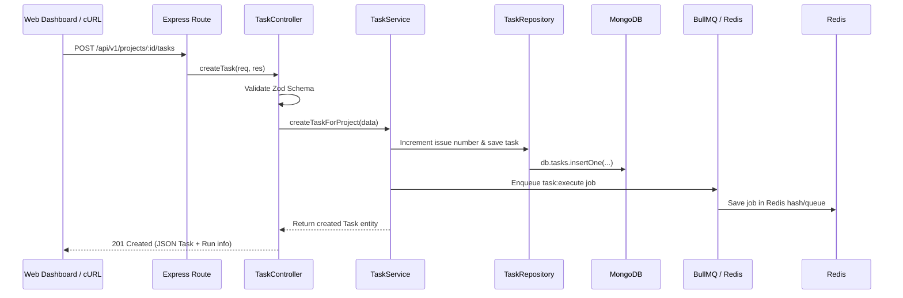

#### 💡 Core Concepts & Why It's Built This Way:
- **Clean 4-Tier Layering**:
  1. **Routes**: Pure URL matching (0 logic).
  2. **Controllers**: Input validation (Zod) and HTTP status translation.
  3. **Services**: Business rules (auto-generating branch names, validating FSM transitions, enqueuing background jobs).
  4. **Repositories**: Database persistence queries.
- **Asynchronous Task Offloading**: The HTTP request does NOT execute the AI agent. It creates the task in MongoDB, enqueues a job into Redis, and returns `201 Created` within 10ms. The background worker picks up the heavy execution asynchronously.

#### 🧪 How to Manually Run & Test:
```bash
# 1. Create a project (piped to jq)
curl -s -X POST http://localhost:4000/api/v1/projects \
  -H "Content-Type: application/json" \
  -d '{"name": "Backend Service", "description": "Core control plane"}' | jq .

# 2. List projects (piped to jq)
curl -s http://localhost:4000/api/v1/projects | jq .

# 3. Create a task under the project (auto-generates issue number and branch, piped to jq)
curl -s -X POST http://localhost:4000/api/v1/projects/backend-service/tasks \
  -H "Content-Type: application/json" \
  -d '{"repositoryId": "repo_1", "title": "Implement rate limiting"}' | jq .

# 4. List tasks with filtering (piped to jq)
curl -s "http://localhost:4000/api/v1/tasks?status=QUEUED" | jq .

# 5. Cancel a task (validates transition to CANCELLED)
curl -s -X POST http://localhost:4000/api/v1/tasks/<TASK_ID>/cancel \
  -H "Content-Type: application/json" \
  -d '{"reason": "Cancelled by user"}' | jq .

# 6. Retry a cancelled/failed task (validates transition back to QUEUED)
curl -s -X POST http://localhost:4000/api/v1/tasks/<TASK_ID>/retry | jq .
```

---

## Phase 4 — Queue + Worker

### Task 4.1: Redis + BullMQ Queue Engine

#### 📂 Key Files to Study:
- [`packages/queue/src/queue.ts`](./packages/queue/src/queue.ts) — `TaskQueueManager` (Job Producer) for dispatching tasks with deduplication IDs.
- [`packages/queue/src/worker.ts`](./packages/queue/src/worker.ts) — `TaskWorkerManager` (Job Consumer) with concurrency control and lifecycle hooks.
- [`apps/worker/src/worker.ts`](./apps/worker/src/worker.ts) — Worker process entrypoint and signal handling.

#### 🔄 Queue & Worker Data Flow:
```mermaid
flowchart LR
    subgraph API_Process["apps/api (Producer)"]
        API[TaskService]
        QueueManager[TaskQueueManager]
    end

    subgraph Redis_Engine["Redis In-Memory Engine"]
        JobQueue[("BullMQ List & Hash\n(Job Payload)")]
        Locks[("Distributed Locks\n(Lua Scripts)")]
        PubSub[("Pub/Sub Channels\n(Job Events)")]
    end

    subgraph Worker_Process["apps/worker (Consumer)"]
        WorkerManager[TaskWorkerManager]
        WorkerService[Worker Execution Loop]
    end

    API -->|1. enqueueTask()| QueueManager
    QueueManager -->|2. LPUSH job payload| JobQueue
    WorkerManager -->|3. Atomic Lock & Pop| Locks
    JobQueue -.-> WorkerManager
    WorkerManager -->|4. processJob()| WorkerService
    WorkerService -->|5. Publish progress/completion| PubSub
```

#### 💡 Core Concepts & Why It's Built This Way:
- **Why BullMQ + Redis?**: BullMQ is a Node.js library (code), not a database. It uses Redis as its high-speed in-memory engine to persist job queues, coordinate distributed locks (so multiple worker nodes don't execute the same task at once), and handle delayed retries.
- **Deterministic Job IDs (`${taskId}__${runId}`)**: Setting the job ID to `taskId__runId` prevents duplicate jobs from ever being enqueued twice if the API or user retries a request (BullMQ uses `__` as custom delimiter).
- **Exponential Backoff**: When jobs fail (e.g. LLM rate limit), BullMQ uses Redis Sorted Sets (`ZSET`) to delay retrying for 2s, 4s, 8s automatically without blocking any Node.js event loop.

#### 🧠 In Simple Words: How Does the Worker Know a Task Was Created?
> **The Doorbell Analogy 🔔**
> 1. `apps/api` and `apps/worker` **never talk directly to each other** (they run in separate terminal windows / servers).
> 2. When the **Worker** starts up, it connects to Redis and says: *"I'm going to sleep. Ring my phone the exact millisecond a new task arrives in the queue"* (this is an open TCP network socket with the Redis `BLMOVE` blocking command). The worker uses **0% CPU** while sleeping.
> 3. When you make an API request, `apps/api` drops the new task into Redis.
> 4. Redis instantly **rings the open line** to the sleeping worker.
> 5. The Worker wakes up in **less than 1 millisecond**, grabs the task data, and executes it!

#### 🧪 How to Manually Run & Test:

##### Step 1: Ensure Containers Are Running
```bash
docker compose -f infra/docker-compose.yml up -d
```

##### Step 2: Start the API in Terminal 1
```bash
pnpm run dev:api
```

##### Step 3: Start the Worker in Terminal 2
```bash
pnpm run dev:worker
```

##### Step 4: Check Dual Readiness (MongoDB + Redis) in Terminal 3
```bash
curl -s http://localhost:4000/ready | jq .
```
**Expected Output:**
```json
{
  "status": "ready",
  "database": { "status": "healthy", "latencyMs": 2 },
  "redis": { "status": "healthy", "latencyMs": 1 }
}
```

##### Step 5: Dispatch a Task to the Background Queue
```bash
curl -s -X POST http://localhost:4000/api/v1/projects/backend-service/tasks \
  -H "Content-Type: application/json" \
  -d '{
    "repositoryId": "repo_demo",
    "title": "Async worker demo",
    "description": "Queued into BullMQ"
  }' | jq .
```

##### Step 6: Observe Terminal 2 (Worker Output)
The background worker instantly consumes the job from Redis with correlated `jobId: taskId__runId` without blocking the API:
```text
[INFO] (task-worker): Job execution started (jobId: taskId__runId)
[INFO] (agent-worker): Processing engineering task job
[INFO] (task-worker): Job execution completed successfully
```

---

### Task 4.2: Worker Service Foundation & State Persistence

#### 📂 Key Files to Study:
- [`apps/worker/src/worker.ts`](./apps/worker/src/worker.ts) — Worker service implementation, atomic state transition lifecycle, and shutdown handling.
- [`packages/database/src/repositories/task-run.repository.ts`](./packages/database/src/repositories/task-run.repository.ts) — `TaskRunRepository` with atomic create, status updates, completion, and failure tracking.
- [`packages/queue/src/worker.ts`](./packages/queue/src/worker.ts) — BullMQ `Worker` encapsulation, concurrency throttling, and connection options.

#### 🔄 Worker Execution & Persistence Flow:
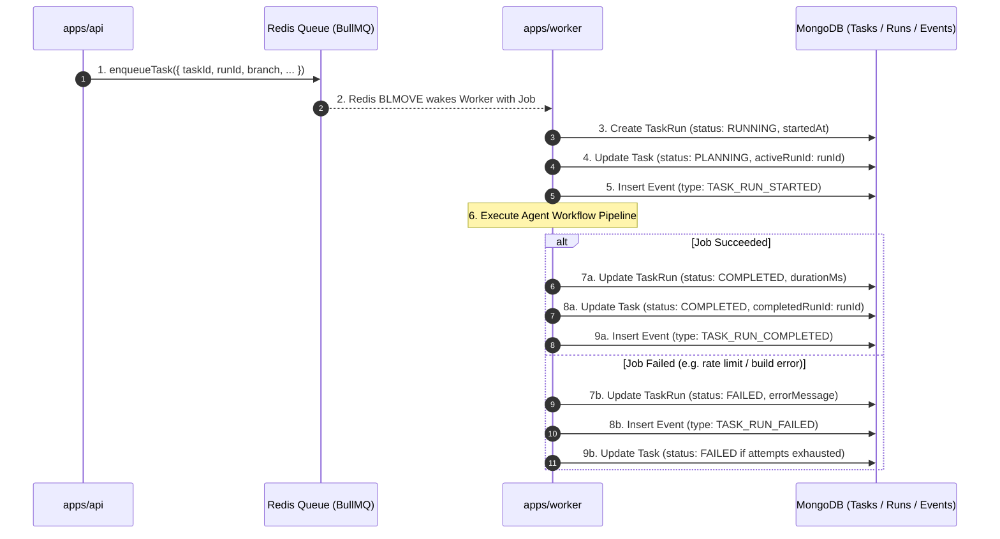

#### 💡 Core Concepts & Why It's Built This Way:
- **Task vs TaskRun Entity Separation**: A `Task` represents the persistent business issue (e.g. "Fix auth token bug"). A `TaskRun` represents a specific execution attempt with its own LLM provider, prompt parameters, duration, and error trace. Retrying a task spawns a new `TaskRun` without losing history of previous attempts.
- **Atomic State Transitions**: Status transitions (`QUEUED` $\rightarrow$ `PLANNING` $\rightarrow$ `COMPLETED`/`FAILED`) are persisted in MongoDB at each milestone, ensuring the control plane reflects the exact state of work even if the host abruptly restarts.
- **Audit Trail via Events Collection**: Every key lifecycle event (`TASK_RUN_STARTED`, `TASK_RUN_COMPLETED`, `TASK_RUN_FAILED`) is logged to the `events` collection with microsecond timestamps, powering the real-time activity stream on the web dashboard.
- **Graceful Shutdown & Active Job Drainage**: On `SIGTERM` / `SIGINT`, the worker immediately pauses intake of new jobs from Redis (`worker.pause()`), waits for actively executing jobs to finish cleanly (`worker.close()`), disconnects the MongoDB client, and exits with code 0.

#### 🧪 How to Manually Run & Test:

##### Step 1: Ensure Containers & Services Are Running
In Terminal 1 (API):
```bash
pnpm run dev:api
```

In Terminal 2 (Worker):
```bash
pnpm run dev:worker
```

##### Step 2: Create a Project (if not created yet) in Terminal 3
```bash
curl -s -X POST http://localhost:4000/api/v1/projects \
  -H "Content-Type: application/json" \
  -d '{
    "name": "Backend Service",
    "slug": "backend-service",
    "ownerId": "user_demo"
  }' | jq .
```

##### Step 3: Dispatch an Engineering Task to the Queue
```bash
curl -s -X POST http://localhost:4000/api/v1/projects/backend-service/tasks \
  -H "Content-Type: application/json" \
  -d '{
    "repositoryId": "repo_demo",
    "title": "Optimize DB Query Indexing",
    "description": "Add compound index for faster lookup"
  }' | jq .
```
**Capture the `_id` from the output as `TASK_ID` (e.g. `6a9cf2425d9b845db6781a18`).**

##### Step 4: Verify Worker Processed and Persisted the Job
Observe Terminal 2 (Worker) — notice the structured logs tracking the complete lifecycle:
```text
[INFO] (agent-worker): Worker picked up engineering task job (taskId: "...", runId: "...")
[INFO] (agent-worker): Executing agent workflow pipeline (placeholder for Phase 5)
[INFO] (agent-worker): Job execution completed successfully (durationMs: ...)
```

##### Step 5: Query Task Details & Verify `TaskRun` in MongoDB via API
```bash
curl -s http://localhost:4000/api/v1/tasks/<TASK_ID> | jq .
```
**Expected Output:**
```json
{
  "task": {
    "_id": "<TASK_ID>",
    "title": "Optimize DB Query Indexing",
    "status": "COMPLETED",
    "activeRunId": "<RUN_ID>",
    "completedRunId": "<RUN_ID>"
  },
  "runs": [
    {
      "_id": "<RUN_ID>",
      "taskId": "<TASK_ID>",
      "status": "COMPLETED",
      "provider": "OPENROUTER",
      "model": "anthropic/claude-3.5-sonnet",
      "maxSteps": 30,
      "durationMs": 12
    }
  ],
  "steps": []
}
```

##### Step 6: Test Graceful Worker Shutdown
In Terminal 2, press `Ctrl+C`:
```text
^C
[INFO] (agent-worker): Stopping Agent Worker Service gracefully...
[INFO] (agent-worker): Agent Worker Service stopped cleanly
```
The worker gracefully drains in-flight jobs, disconnects from MongoDB and Redis, and terminates without errors.

---

## Phase 5 — LLM Provider Layer

### Task 5.1: Generic Provider Contract & Factory Architecture

#### 📂 Key Files to Study:
- [`packages/llm/src/interfaces.ts`](./packages/llm/src/interfaces.ts) — Generic `LLMProvider` contract (`generate`, `stream`, `supports`, `getCapabilities`).
- [`packages/llm/src/types.ts`](./packages/llm/src/types.ts) — Normalized `LLMRequest`, `LLMResponse`, `ToolDefinition`, `ToolCall`, `ToolResult`, and token usage data types.
- [`packages/llm/src/factory.ts`](./packages/llm/src/factory.ts) — `ProviderFactory` dynamic registry, instantiation, and instance caching.
- [`packages/llm/src/errors.ts`](./packages/llm/src/errors.ts) — Normalized provider error hierarchy (`RateLimitError`, `AuthError`, `InvalidRequestError`, `ProviderTimeoutError`, `ContextWindowExceededError`).
- [`packages/llm/src/base-provider.ts`](./packages/llm/src/base-provider.ts) — `BaseLLMProvider` abstract template and `MockLLMProvider` for offline testing.

#### 🔄 LLM Provider Contract Architecture:
```mermaid
flowchart TD
    subgraph Agent_Runtime["Agent Runtime (apps/worker)"]
        AgentLoop["Agent Core Loop (Phase 6)"]
        Context["Context Builder (Phase 6)"]
    end

    subgraph Generic_Contract["Generic LLM Contract (@buildpilot/llm)"]
        LLMProvider["interface LLMProvider\n(generate, stream, supports)"]
        Types["Normalized Data Types\n(LLMRequest, LLMResponse, ToolCall, ToolResult)"]
        Errors["Normalized Error Hierarchy\n(RateLimitError, AuthError, TimeoutError)"]
        Factory["ProviderFactory\n(Dynamic Registry & Cache)"]
    end

    subgraph Provider_Adapters["Provider Adapters (Phase 5)"]
        OpenRouter["OpenRouterProvider\n(Task 5.2)"]
        OpenAI["OpenAICompatibleProvider\n(Task 5.3)"]
        Anthropic["AnthropicProvider"]
        Mock["MockLLMProvider\n(Offline & CI)"]
    end

    AgentLoop -->|Calls generate() / stream()| LLMProvider
    Context -->|Constructs| Types
    AgentLoop -.->|Handles normalized errors| Errors
    AgentLoop -->|Requests provider instance| Factory
    Factory -->|Instantiates| OpenRouter
    Factory -->|Instantiates| OpenAI
    Factory -->|Instantiates| Anthropic
    Factory -->|Instantiates| Mock
```

#### 💡 Core Concepts & Why It's Built This Way:
- **Dependency Inversion Principle (DIP)**: Agent code depends strictly on the abstract `LLMProvider` interface, never on third-party vendor SDKs (`openai`, `@anthropic-ai/sdk`, `@google/genai`). Switching between OpenRouter, local Ollama, Groq, or OpenAI requires zero changes to the agent loop.
- **Normalized Tool Calling Standard**: Different LLM vendors represent tool calls differently (e.g. OpenAI's `tool_calls` vs Anthropic's `tool_use` blocks vs Gemini's `functionCall`). `@buildpilot/llm` unifies them into standard `ToolDefinition`, `ToolCall`, and `ToolResult` schemas.
- **Normalized Error Hierarchy**: Vendor-specific HTTP status codes and JSON error objects are parsed into standard error classes (`RateLimitError`, `AuthError`, `ProviderTimeoutError`, `ContextWindowExceededError`) with explicit `retryable: boolean` flags. This tells BullMQ queue workers and agent loops whether to back off and retry or fail immediately.
- **Dynamic Factory & Offline Mockability**: `providerFactory` provides decoupled registration and instance caching. Built-in `MockLLMProvider` enables 100% offline unit tests and CI testing without needing live API tokens or spending LLM credits.

#### 🧪 How to Manually Run & Test:

##### Step 1: Run the LLM Package Test Suite
```bash
pnpm --filter @buildpilot/llm test
```
**Expected Output:**
```text
 ✓ src/index.test.ts (19 tests)
 Test Files  1 passed (1)
      Tests  19 passed (19)
```

##### Step 2: Verify Monorepo Full Typecheck & Build
```bash
pnpm run typecheck && pnpm run build
```
Verify that all 12 monorepo packages compile cleanly without type mismatches.

---

### Task 5.2: OpenRouter Provider Adapter & Tool Calling

#### 📂 Key Files to Study:
- [`packages/llm/src/openrouter.ts`](./packages/llm/src/openrouter.ts) — `OpenRouterProvider` adapter with system prompt prepending, tool definition formatting, response parsing, error normalization, and SSE streaming.
- [`packages/llm/src/openrouter.test.ts`](./packages/llm/src/openrouter.test.ts) — Comprehensive unit test suite with mock fetch fixtures covering tool calling, rate limiting, and SSE streaming.
- [`packages/llm/src/scripts/test-openrouter.ts`](./packages/llm/src/scripts/test-openrouter.ts) — Standalone CLI demonstration script.

#### 🔄 OpenRouter Adapter Execution Flow:
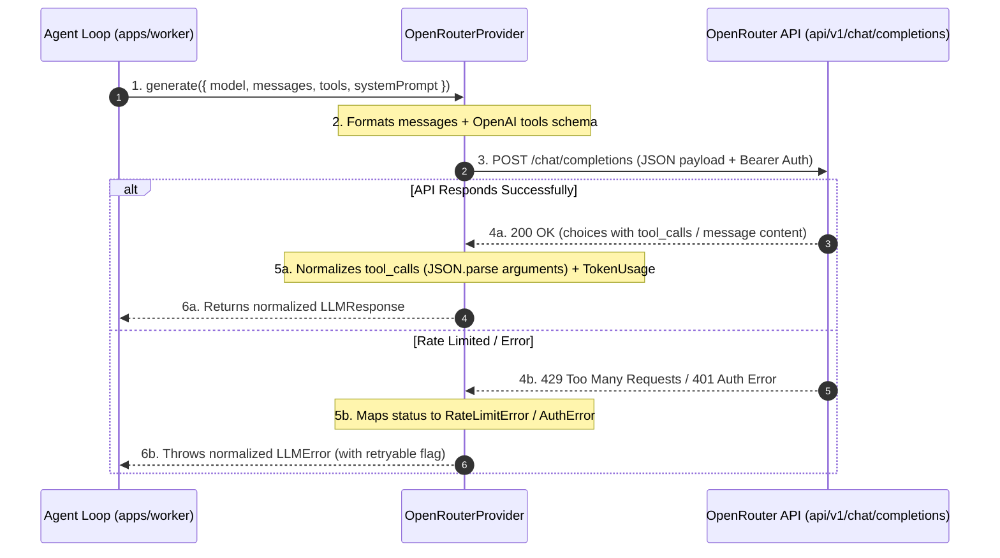

#### 💡 Core Concepts & Why It's Built This Way:
- **Unified Multi-Model Gateway**: OpenRouter provides a single standard API to route prompts to 200+ models (Anthropic Claude 3.5 Sonnet, OpenAI GPT-4o, DeepSeek-R1, Gemini 1.5 Pro) with consistent tool-calling semantics.
- **Resilient Tool Argument Deserialization**: In tool calling, LLMs return tool arguments as stringified JSON. The adapter parses the JSON into typed JavaScript objects while gracefully preserving `rawArguments` if partial output is received.
- **Automatic Status Code Normalization**: HTTP error responses are intercepted and transformed into strongly typed error classes:
  - `401/403` $\rightarrow$ `AuthError` (`retryable: false`)
  - `429` $\rightarrow$ `RateLimitError` (`retryable: true`)
  - `400 (context limit)` $\rightarrow$ `ContextWindowExceededError` (`retryable: false`)
  - `408/Timeout` $\rightarrow$ `ProviderTimeoutError` (`retryable: true`)
  - `500+` $\rightarrow$ `ProviderUnavailableError` (`retryable: true`)
- **SSE Stream Reader**: When streaming responses, the adapter uses native `ReadableStream` reader with line buffering to yield `LLMStreamChunk` objects in real time.

#### 🧪 How to Manually Run & Test:

##### Step 1: Run All Unit Tests for the LLM Package
```bash
pnpm --filter @buildpilot/llm test
```
**Expected Output:**
```text
 ✓ src/index.test.ts (19 tests)
 ✓ src/openrouter.test.ts (13 tests)
 Test Files  2 passed (2)
      Tests  32 passed (32)
```

##### Step 2: Run the Standalone OpenRouter Demonstration Script
```bash
pnpm --filter @buildpilot/llm test:openrouter
```
**Expected Output (Without API Key - Safe Mock Demo):**
```text
ℹ️  No OPENROUTER_API_KEY found in environment. Running in mock demonstration mode.
🚀 Initializing OpenRouterProvider with model: anthropic/claude-3.5-sonnet
📤 Sending prompt with tool definitions...
❌ Request error: Failed to reach OpenRouter API: fetch failed PROVIDER_UNAVAILABLE_ERROR
💡 Note: Set OPENROUTER_API_KEY in your .env or shell to execute live network calls.
```

*(Optional: Set `export OPENROUTER_API_KEY=sk-or-v1-...` in your shell to execute live network calls against OpenRouter).*

---

### Task 5.3: OpenAI-Compatible Provider Adapter (Local Ollama, Groq, vLLM)

#### 📂 Key Files to Study:
- [`packages/llm/src/openai-compatible.ts`](./packages/llm/src/openai-compatible.ts) — OpenAI-compatible provider adapter supporting standard OpenAI, Ollama, Groq, vLLM, custom baseURLs, headers, and SSE streaming.
- [`packages/llm/src/openai-compatible.test.ts`](./packages/llm/src/openai-compatible.test.ts) — Unit test suite verifying completions, tool calling, error normalization, and cross-provider DIP interchangeability.
- [`packages/llm/src/scripts/test-openai-compatible.ts`](./packages/llm/src/scripts/test-openai-compatible.ts) — Standalone CLI demonstration script.

#### 🔄 Multi-Provider Interchangeability Architecture:
```mermaid
flowchart TD
    subgraph Agent_Layer["Agent Reasoning Layer (apps/worker)"]
        AgentLoop["Agent Core Loop\n(Identical Code)"]
    end

    subgraph LLM_Interface["@buildpilot/llm Abstraction"]
        Contract["interface LLMProvider\n(generate, stream, supports)"]
        Factory["providerFactory.create(config)"]
    end

    subgraph Adapters["Provider Adapters"]
        OpenRouter["OpenRouterProvider\n(https://openrouter.ai/api/v1)"]
        OpenAI["OpenAICompatibleProvider\n(https://api.openai.com/v1)"]
        Ollama["OpenAICompatibleProvider\n(http://localhost:11434/v1)"]
        Groq["OpenAICompatibleProvider\n(https://api.groq.com/openai/v1)"]
    end

    AgentLoop -->|Calls generate()| Contract
    Factory -->|Instantiates| OpenRouter
    Factory -->|Instantiates| OpenAI
    Factory -->|Instantiates| Ollama
    Factory -->|Instantiates| Groq
    OpenRouter -.->|Implements| Contract
    OpenAI -.->|Implements| Contract
    Ollama -.->|Implements| Contract
    Groq -.->|Implements| Contract
```

#### 💡 Core Concepts & Why It's Built This Way:
- **Universal OpenAI Wire Protocol**: Most local and cloud LLM inference engines (Ollama, vLLM, Groq, LM Studio, Together AI) adhere to the OpenAI `/chat/completions` REST format. A single robust adapter enables BuildPilot to run across both enterprise clouds and air-gapped local clusters.
- **Zero Cloud API Cost / Private Mode**: By pointing `baseUrl` to `http://localhost:11434/v1` (Ollama) with open-weights models (such as `qwen2.5-coder:32b` or `deepseek-coder-v2`), engineering teams can run automated agent pipelines with 100% on-premise data privacy.
- **Dependency Inversion in Action**: Agent reasoning algorithms and tool loops have zero vendor-specific imports. Changing from OpenRouter Claude 3.5 to local Ollama requires changing only the configuration file or UI dropdown, without touching a single line of agent code.

#### 🧪 How to Manually Run & Test:

##### Step 1: Run All LLM Unit Tests
```bash
pnpm --filter @buildpilot/llm test
```
**Expected Output:**
```text
 ✓ src/index.test.ts (19 tests)
 ✓ src/openrouter.test.ts (13 tests)
 ✓ src/openai-compatible.test.ts (12 tests)
 Test Files  3 passed (3)
      Tests  44 passed (44)
```

##### Step 2: Run the Standalone OpenAI-Compatible Demonstration Script
```bash
pnpm --filter @buildpilot/llm test:openai
```
**Expected Output (Without API Key - Safe Mock Demo):**
```text
🚀 Initializing OpenAICompatibleProvider with endpoint: https://api.openai.com/v1, model: gpt-4o
📤 Sending prompt with tool definitions...
❌ Request error: Failed to reach OpenAI-compatible provider at 'https://api.openai.com/v1': fetch failed PROVIDER_UNAVAILABLE_ERROR
💡 Note: Set OPENAI_API_KEY or OPENAI_BASE_URL (e.g. for Ollama) in your environment to execute live network calls.
```

*(Optional: Set `export OPENAI_BASE_URL=http://localhost:11434/v1` and `export OPENAI_MODEL=qwen2.5-coder:32b` to test with a locally running Ollama instance).*

---

## Phase 6 — Agent Runtime

### Task 6.1: Context Builder & Token Budget Management

#### 📂 Key Files to Study:
- [`apps/worker/src/agent/context-builder.ts`](./apps/worker/src/agent/context-builder.ts) — Main `ContextBuilder` assembling system prompts, task goals, repo context, and history within strict budgets.
- [`apps/worker/src/agent/token-budget.ts`](./apps/worker/src/agent/token-budget.ts) — Token estimation algorithms, middle-out truncation, file tree formatting, and history message pruning.
- [`apps/worker/src/agent/prompts.ts`](./apps/worker/src/agent/prompts.ts) — Base system prompt templates, task goals, and repository summary formatting.
- [`apps/worker/src/agent/context-builder.test.ts`](./apps/worker/src/agent/context-builder.test.ts) — Unit test suite verifying token budgets, tool output truncation, and context window safety.

#### 🔄 Context Assembly & Budgeting Flow:
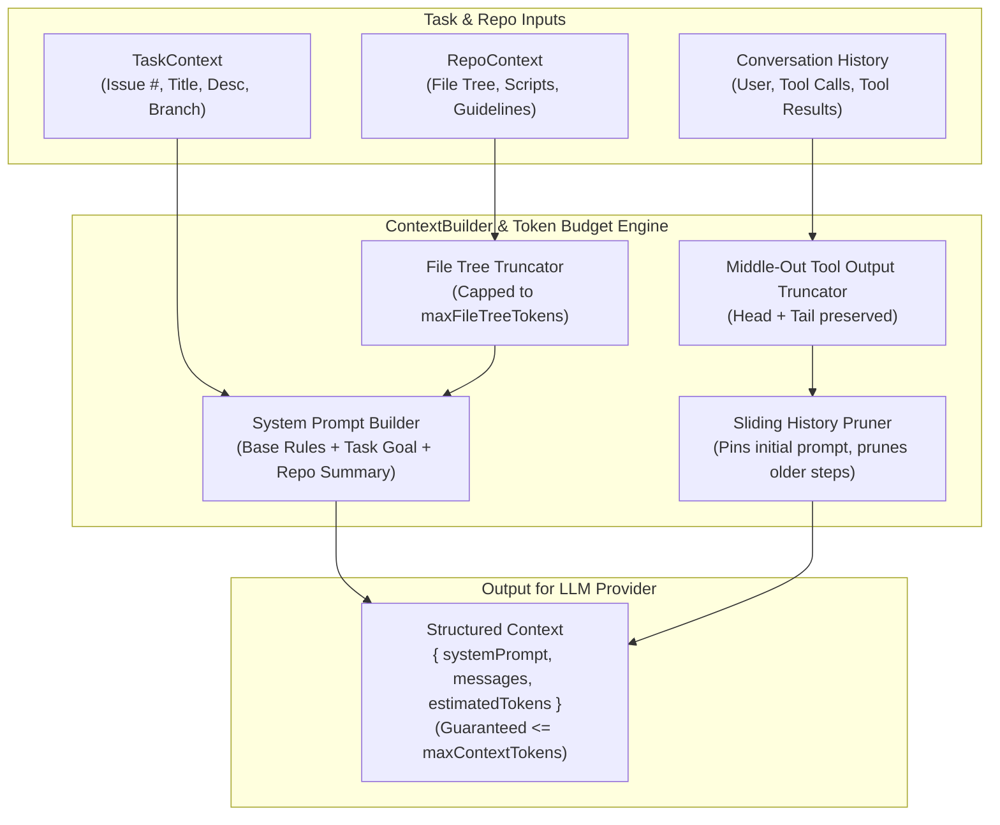

#### 💡 Core Concepts & Why It's Built This Way:
- **Context Window is Finite & Costly**: Modern frontier models have varying context windows (e.g. 128k, 32k, 8k tokens). Without strict budgeting, reading large source files or executing verbose commands (like `pnpm test` with 5,000 lines of output) will blow past limits and crash with `400 ContextWindowExceededError`.
- **Middle-Out Truncation Strategy**: When truncating oversized tool outputs, cutting the middle while keeping the head (declarations/inputs) and tail (error traces/summary results) preserves the most critical diagnostic information.
- **Task Goal Pinning & History Pruning**: The original developer instruction (Issue description) is permanently pinned at index 0. If conversation steps grow long across 30+ turns, older intermediate thoughts are pruned while retaining recent reasoning steps.
- **Fast Heuristic Token Estimation**: Estimates tokens accurately (~3.8 characters per token) without adding heavy WebAssembly tokenizer dependencies or slowing down the agent loop.

#### 🧪 How to Manually Run & Test:

##### Step 1: Run the Agent Runtime ContextBuilder Test Suite
```bash
pnpm --filter @buildpilot/worker test
```
**Expected Output:**
```text
 ✓ src/agent/context-builder.test.ts (12 tests)
 ✓ src/worker.test.ts (7 tests)
 Test Files  2 passed (2)
      Tests  19 passed (19)
```

##### Step 2: Run Full Monorepo Test Suite
```bash
pnpm test
```
Verify that all test suites pass with 100% clean verification across all 12 packages.

---

### Task 6.2: Agent Core Loop with Multi-Step Tool Execution & Persistence

#### 📂 Key Files to Study:
- [`apps/worker/src/agent/agent-loop.ts`](./apps/worker/src/agent/agent-loop.ts) — Autonomous ReAct agent loop execution engine with Zod schema validation, safety timeouts, cancellation token handling, and live MongoDB persistence.
- [`apps/worker/src/agent/agent-loop.test.ts`](./apps/worker/src/agent/agent-loop.test.ts) — Unit test suite verifying multi-step tool calls, schema rejection, error recovery, step limit enforcement, and DB audit logging.
- [`packages/database/src/repositories/agent-step.repository.ts`](./packages/database/src/repositories/agent-step.repository.ts) — Real-time persistence repository for LLM thoughts, prompts, tool calls, and completion tokens.
- [`packages/database/src/repositories/tool-call.repository.ts`](./packages/database/src/repositories/tool-call.repository.ts) — Real-time persistence repository for tool execution inputs, outputs, error traces, and latency.

#### 🔄 Multi-Step Agent Execution Flow:
```mermaid
sequenceDiagram
    autonumber
    participant Worker as WorkerService (apps/worker)
    participant Loop as AgentCoreLoop
    participant Ctx as ContextBuilder
    participant LLM as LLMProvider (OpenRouter/OpenAI)
    participant Registry as ToolRegistry (@buildpilot/tools)
    participant DB as MongoDB (agent_steps & tool_calls)

    Worker->>Loop: 1. execute({ task, repo, provider, tools })
    Loop->>Ctx: 2. build({ task, repo, history })
    Ctx-->>Loop: 3. Formatted prompt within token budget
    
    loop While step <= maxSteps && not completed
        Loop->>LLM: 4. generate({ systemPrompt, messages, tools })
        LLM-->>Loop: 5. LLMResponse (thought text + tool_calls)
        Loop->>DB: 6. Persist AgentStep (type: MODEL_REASONING, status: RUNNING)
        
        alt Has Tool Calls
            loop For each ToolCall
                Loop->>Registry: 7. Validate tool arguments with Zod
                alt Arguments Valid & Tool Found
                    Loop->>Registry: 8. Execute tool with per-tool timeout
                    Registry-->>Loop: 9. Tool execution output
                    Loop->>DB: 10. Persist ToolCall record (status: SUCCESS)
                else Validation Error / Unknown Tool
                    Loop->>DB: 10b. Persist ToolCall record (status: FAILED)
                    Note over Loop: 11. Feed error back as tool result for self-correction
                end
            end
            Loop->>Loop: 12. Append tool results to message history
            Loop->>DB: 13. Mark AgentStep as COMPLETED
        else No Tool Calls (Final Answer Reached)
            Loop->>DB: 14. Mark AgentStep as COMPLETED
            Loop-->>Worker: 15. Return { success: true, finalAnswer, stepsCount }
        end
    end
```

#### 💡 Core Concepts & Why It's Built This Way:
- **Autonomous Tool-Calling Loop**: The core loop follows the ReAct (Reasoning + Action) pattern. The LLM reasons about the task, decides which tools to invoke (e.g. `read_file`, `search_code`), inspects their outputs, and repeats until it synthesizes the final solution.
- **Strict Zod Argument Validation**: LLMs occasionally hallucinate parameter types or omit required fields. Before invoking any system tool, arguments are parsed and validated through runtime Zod schemas. If invalid, the error message is fed back directly to the LLM so it can immediately correct its call.
- **Granular Real-Time DB Persistence**: Every reasoning step (`agent_steps`) and every individual tool execution (`tool_calls`) is saved to MongoDB asynchronously as it happens. This powers live timeline updates on the web dashboard (via SSE) and provides post-mortem auditability.
- **Comprehensive Safety Guards**:
  - `maxSteps`: Caps total LLM roundtrips (default 30) to prevent infinite billing loops.
  - `maxWallClockMs`: Enforces overall timeout per task run.
  - `toolTimeoutMs`: Enforces per-tool execution limit (e.g. preventing a hanging command from stalling the worker).
  - `cancellationToken`: Allows immediate user-initiated cancellation from the dashboard.

#### 🧪 How to Manually Run & Test:

##### Step 1: Run the Agent Core Loop Unit Tests
```bash
pnpm --filter @buildpilot/worker test
```
**Expected Output:**
```text
 ✓ src/agent/agent-loop.test.ts (6 tests)
 ✓ src/agent/context-builder.test.ts (12 tests)
 ✓ src/worker.test.ts (7 tests)
 Test Files  3 passed (3)
      Tests  25 passed (25)
```

##### Step 2: Run Full Monorepo Test Suite
```bash
pnpm test
```
Verify that all 21 test suites pass across all 12 monorepo packages.

---

### Task 6.3: Agent Failure Recovery, Transient Retry & Loop Protection

#### 📂 Key Files to Study:
- [`apps/worker/src/agent/failure-recovery.ts`](./apps/worker/src/agent/failure-recovery.ts) — Exponential backoff retry engine (`retryWithBackoff`) with jitter/delays and `LoopDetector` guarding against repetitive failing tool invocations.
- [`apps/worker/src/agent/agent-loop.ts`](./apps/worker/src/agent/agent-loop.ts) — Integration of failure recovery into the agent core loop, generating self-correction feedback prompts and persisting failure diagnostic events (`AGENT_EXECUTION_FAILED`).
- [`apps/worker/src/agent/failure-recovery.test.ts`](./apps/worker/src/agent/failure-recovery.test.ts) — Unit test suite verifying backoff math, retryable vs non-retryable error discernment, and loop threshold trips.

#### 🔄 Failure Recovery & Loop Guard Flow:
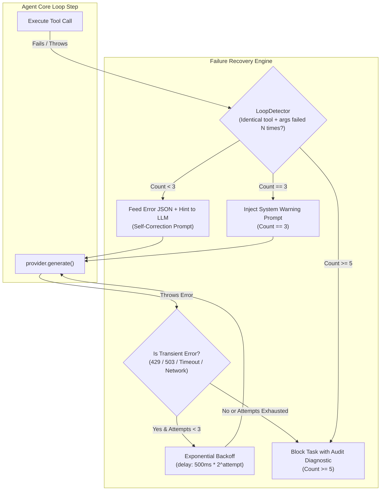

#### 💡 Core Concepts & Why It's Built This Way:
- **Resilient Transient Error Handling**: Network drops, API rate limits (`429`), and temporary upstream downtime (`503`) are common in LLM operations. Rather than crashing long-running task runs, `retryWithBackoff` transparently retries up to 3 times with exponential backoff before reporting a hard failure.
- **Model Self-Correction via Structured Error Feedback**: When an LLM passes invalid tool arguments or when a tool returns a non-zero exit code, BuildPilot returns a structured JSON payload containing the exact error and an actionable hint (e.g. schema requirement or available alternatives). This enables frontier models to self-correct in the next step.
- **Infinite Failure Loop Guard (`LoopDetector`)**: Without guards, autonomous models may get stuck in repetitive failure loops (calling the same broken command 20 times). `LoopDetector` fingerprints `tool::JSON.stringify(args)`. At 3 failures it issues a high-priority system warning, and at 5 consecutive identical failures it immediately aborts the loop to prevent token wastage.
- **Detailed Failure Audit Diagnostics**: Whenever an agent run terminates due to step limits, timeouts, or unrecoverable provider errors, structured failure events (`AGENT_EXECUTION_FAILED`) are recorded in MongoDB with error message, step count, and execution duration for transparent debugging on the dashboard.

#### 🧪 How to Manually Run & Test:

##### Step 1: Run the Failure Recovery & Agent Loop Unit Tests
```bash
pnpm --filter @buildpilot/worker test
```
**Expected Output:**
```text
 ✓ src/agent/failure-recovery.test.ts (8 tests)
 ✓ src/agent/agent-loop.test.ts (8 tests)
 ✓ src/agent/context-builder.test.ts (12 tests)
 ✓ src/worker.test.ts (7 tests)
 Test Files  4 passed (4)
      Tests  35 passed (35)
```

##### Step 2: Run Full Monorepo Test Suite
```bash
pnpm test
```
Verify that all test suites pass cleanly across all 12 monorepo packages.

---

## Phase 7 — First Tool Registry

### Task 7.1: Typed Tool Framework & Permission Policies

#### 📂 Key Files to Study:
- [`packages/tools/src/types.ts`](./packages/tools/src/types.ts) — Typed `ToolDefinition<TInput, TOutput>`, `ToolContext`, `ToolExecutionResult`, and permission classes (`READ_ONLY`, `SAFE_WRITE`, `EXTERNAL_WRITE`, `HIGH_RISK`).
- [`packages/tools/src/registry.ts`](./packages/tools/src/registry.ts) — Central `ToolRegistry` with Zod schema validation, execution timeouts, permission policy enforcement, and LLM JSON schema formatting.
- [`packages/tools/src/errors.ts`](./packages/tools/src/errors.ts) — Structured tool error hierarchy (`UnknownToolError`, `ToolValidationError`, `ToolPermissionError`, `ToolTimeoutError`).
- [`packages/tools/src/registry.test.ts`](./packages/tools/src/registry.test.ts) — Unit test suite verifying schema validation, permission class blocking, timeouts, and LLM tool formatting.

#### 🔄 Tool Registry & Permission Architecture:
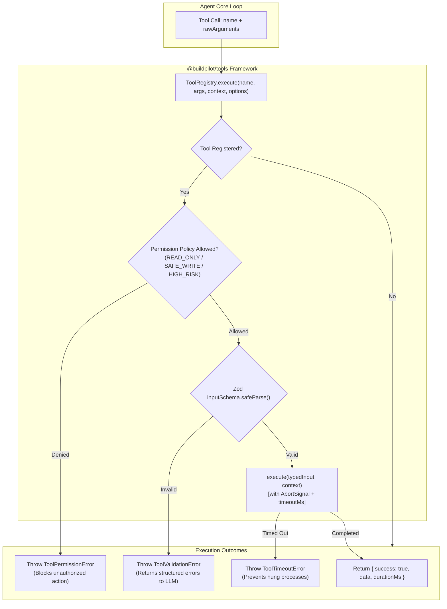

#### 💡 Core Concepts & Why It's Built This Way:
- **Type-Safe Tool Contract**: Each tool defines an `inputSchema` using Zod. Runtime inputs from LLM responses are parsed through this schema, ensuring tool implementations receive strictly validated, type-safe arguments.
- **Granular Permission Classes**:
  - `READ_ONLY`: Inspection tools (`list_files`, `read_file`, `search_code`, `git_status`) that cannot mutate anything.
  - `SAFE_WRITE`: Code modification tools (`write_file`) restricted to the task's isolated worktree.
  - `EXTERNAL_WRITE`: Actions with external side effects (`git_push`, `create_pull_request`).
  - `HIGH_RISK`: Destructive commands (`rm -rf`, system services, deploys) requiring explicit human approval.
- **Fail-Fast Execution Protection**:
  - Per-tool timeouts prevent hanging scripts from exhausting worker concurrency.
  - `AbortSignal` listener ensures that if a task is cancelled from the dashboard, child tool executions terminate immediately.

#### 🧪 How to Manually Run & Test:

##### Step 1: Run the Tool Package Unit Tests
```bash
pnpm --filter @buildpilot/tools test
```
**Expected Output:**
```text
 ✓ src/index.test.ts (1 test)
 ✓ src/registry.test.ts (7 tests)
 Test Files  2 passed (2)
      Tests  8 passed (8)
```

##### Step 2: Run Full Monorepo Test Suite
```bash
pnpm test
```
Verify that all 21 test suites pass cleanly across all 12 monorepo packages.

---

### Task 7.2: Repository Tools (`list_files`, `search_code`, `read_file`, `write_file`, `git_status`, `git_diff`)

#### 📂 Key Files to Study:
- [`packages/tools/src/repository/path-utils.ts`](./packages/tools/src/repository/path-utils.ts) — Workspace sandbox boundary resolution (`resolveSafePath`) guarding against directory traversal attacks.
- [`packages/tools/src/repository/file-tools.ts`](./packages/tools/src/repository/file-tools.ts) — `read_file` (with line slicing & truncation) and `write_file` (with auto directory creation).
- [`packages/tools/src/repository/search-tools.ts`](./packages/tools/src/repository/search-tools.ts) — `list_files` (recursive tree with ignore rules) and `search_code` (regex & text grep matching).
- [`packages/tools/src/repository/git-tools.ts`](./packages/tools/src/repository/git-tools.ts) — `git_status` (porcelain parser) and `git_diff` (patch generator).
- [`packages/tools/src/repository/repository.test.ts`](./packages/tools/src/repository/repository.test.ts) — Unit test suite verifying file manipulation, regex search, path traversal rejection, and git operations.

#### 🔄 Repository Tools Capabilities Matrix:
| Tool Name | Permission Class | Key Parameters | Return Payload |
|---|---|---|---|
| `list_files` | `READ_ONLY` | `path`, `maxDepth`, `limit`, `includeHidden` | `{ count, entries: [{ path, type, sizeBytes }] }` |
| `read_file` | `READ_ONLY` | `path`, `startLine`, `endLine`, `maxLines` | `{ content, totalLines, startLine, endLine, truncated }` |
| `write_file` | `SAFE_WRITE` | `path`, `content`, `createDirectories` | `{ path, bytesWritten, created, updated }` |
| `search_code` | `READ_ONLY` | `query`, `path`, `isRegex`, `caseSensitive`, `maxResults` | `{ query, count, matches: [{ file, lineNumber, lineContent }] }` |
| `git_status` | `READ_ONLY` | `path` | `{ clean, totalChanged, files: [{ path, status, staged, unstaged }] }` |
| `git_diff` | `READ_ONLY` | `staged`, `path`, `maxLines` | `{ diff, totalLines, truncated }` |

#### 💡 Core Concepts & Why It's Built This Way:
- **Workspace Boundary Containment**: To prevent malicious LLM prompts or security exploits from accessing `/etc`, `~/.ssh`, or parent directories, `resolveSafePath` resolves absolute paths and enforces that the target is strictly inside `context.workspaceDir`.
- **Intelligent Default Ignore List**: `list_files` and `search_code` automatically filter out `.git`, `node_modules`, `dist`, `.next`, and binary files (`.png`, `.pdf`, `.zip`), preventing context pollution and wasted token budget.
- **Line Slicing & Truncation**: `read_file` allows agents to read specific line ranges (e.g. lines 50 to 120) instead of loading a 10,000-line file into memory, keeping LLM prompts lean and fast.

#### 🧪 How to Manually Run & Test:

##### Step 1: Run Repository Tools Unit Tests
```bash
pnpm --filter @buildpilot/tools test
```
**Expected Output:**
```text
 ✓ src/registry.test.ts (7 tests)
 ✓ src/index.test.ts (1 test)
 ✓ src/repository/repository.test.ts (5 tests)
 Test Files  3 passed (3)
      Tests  13 passed (13)
```

##### Step 2: Run Full Monorepo Test Suite
```bash
pnpm test
```
Verify that all 21 test suites pass cleanly across all 12 monorepo packages.

---

### Task 7.3: Execution Tools (`run_command`, `run_tests`)

#### 📂 Key Files to Study:
- [`packages/tools/src/execution/command-runner.ts`](./packages/tools/src/execution/command-runner.ts) — Process execution engine with stdout/stderr stream capture, buffer size cap (500KB), timeout enforcement, and SIGKILL escalation.
- [`packages/tools/src/execution/execution-tools.ts`](./packages/tools/src/execution/execution-tools.ts) — `run_command` (shell command runner with exit code handling) and `run_tests` (automated test runner and pass/fail summary generator).
- [`packages/tools/src/execution/execution.test.ts`](./packages/tools/src/execution/execution.test.ts) — Unit test suite verifying output streaming, exit code capture, timeout termination, and test runner pass/fail logic.

#### 🔄 Process Execution Architecture:
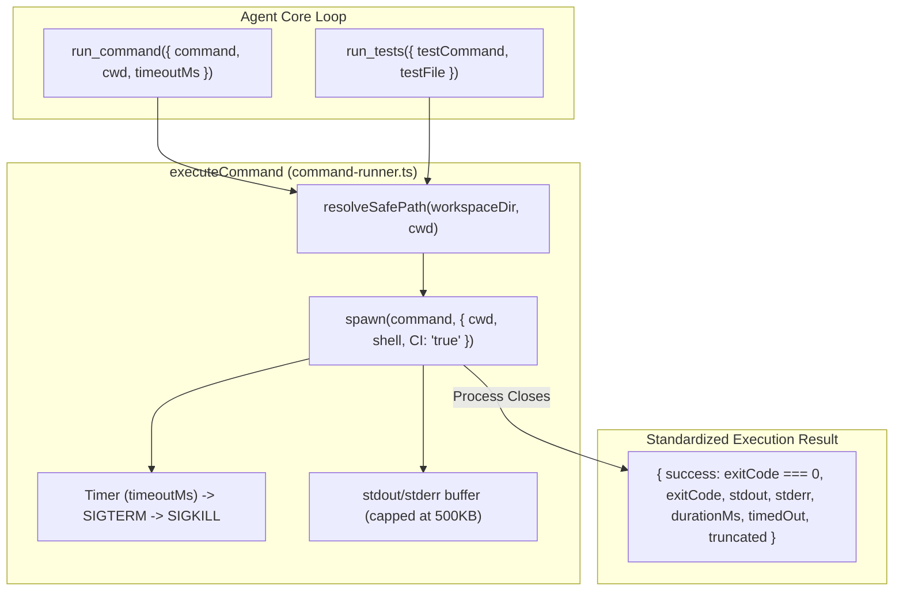

#### 💡 Core Concepts & Why It's Built This Way:
- **Streaming Buffer Cap**: Running commands that produce massive logs (e.g. `npm install` or verbose test runs with 200,000 lines) can easily cause Node.js Out-Of-Memory (OOM) crashes. Output streams are capped to 500KB with explicit `truncated: true` metadata.
- **Two-Phase Process Termination (SIGTERM $\rightarrow$ SIGKILL)**: When a command exceeds its allotted timeout, a gentle `SIGTERM` is sent first to allow graceful exit. If the process does not terminate within 2 seconds, a hard `SIGKILL` is issued to guarantee zero zombie background processes.
- **CI / Headless Environment Normalization**: Commands are executed with `CI=true` and `FORCE_COLOR=0` to disable interactive CLI prompts (e.g. `y/N` questions that would hang the worker) and strip ANSI color escape sequences from prompt history.

#### 🧪 How to Manually Run & Test:

##### Step 1: Run Execution Tools Unit Tests
```bash
pnpm --filter @buildpilot/tools test
```
**Expected Output:**
```text
 ✓ src/registry.test.ts (7 tests)
 ✓ src/index.test.ts (1 test)
 ✓ src/repository/repository.test.ts (5 tests)
 ✓ src/execution/execution.test.ts (5 tests)
 Test Files  4 passed (4)
      Tests  18 passed (18)
```

##### Step 2: Run Full Monorepo Test Suite
```bash
pnpm test
```
Verify that all 21 test suites pass cleanly across all 12 monorepo packages.

---

## Phase 8 — Git Workspace Management

### Tasks 8.1, 8.2, 8.3: Repository Mirroring, Isolated Worktrees & Commit/Push Flow

#### 📂 Key Files to Study:
- [`packages/github/src/git/repository-manager.ts`](./packages/github/src/git/repository-manager.ts) — Git mirror clone & incremental fetch service (`GitRepositoryManager`).
- [`packages/github/src/git/worktree-manager.ts`](./packages/github/src/git/worktree-manager.ts) — Isolated task worktree lifecycle manager (`createWorktree`, `removeWorktree`, `listWorktrees`).
- [`packages/github/src/git/commit-push-service.ts`](./packages/github/src/git/commit-push-service.ts) — Structured task commit creator and atomic remote branch pusher (`GitCommitPushService`).
- [`packages/github/src/git/git.test.ts`](./packages/github/src/git/git.test.ts) — Unit test suite verifying clone, fetch, worktree branching, staged diff extraction, and cleanup.

#### 🔄 Git Worktree Isolation Architecture:
```mermaid
flowchart TD
    subgraph Host["Control Plane Host Storage"]
        Mirror["Repository Mirror\n(/data/repos/owner_name/.git)"]
        Worktree1["Worktree Task A\n(/data/worktrees/task_1_run_1)\nBranch: buildpilot/task-1-abc"]
        Worktree2["Worktree Task B\n(/data/worktrees/task_2_run_1)\nBranch: buildpilot/task-2-xyz"]
    end

    subgraph Remote["Remote Git Server (GitHub / GitLab)"]
        RemoteMain["main branch (Protected)"]
        RemoteTaskA["buildpilot/task-1-abc"]
    end

    RemoteMain -->|1. cloneOrFetch()| Mirror
    Mirror -->|2. git worktree add| Worktree1
    Mirror -->|2. git worktree add| Worktree2
    Worktree1 -->|3. Agent code edits| Worktree1
    Worktree1 -->|4. createCommit() + pushBranch()| RemoteTaskA
    Worktree1 -->|5. removeWorktree()| Mirror
```

#### 💡 Core Concepts & Why It's Built This Way:
- **Zero Cross-Contamination**: Rather than having workers compete over a single checked-out directory, Git worktrees allow multiple workers to execute concurrently on separate task branches using a single shared repository object storage (`.git/objects`), saving 90% disk space and eliminating branch switching conflicts.
- **Protected Base Branch**: Tasks never modify or commit directly to `main`. Every run operates on a dedicated ephemeral branch (`buildpilot/task-<shortTaskId>-<shortRunId>`).
- **Clean Teardown**: Upon task completion or cancellation, `removeWorktree` runs `git worktree remove --force` followed by `git worktree prune`, leaving zero dangling locks or leftover files.

#### 🧪 How to Manually Run & Test:

##### Step 1: Run Git Workspace Unit Tests
```bash
pnpm --filter @buildpilot/github test
```
**Expected Output:**
```text
 ✓ src/index.test.ts (1 test)
 ✓ src/git/git.test.ts (3 tests)
 Test Files  2 passed (2)
      Tests  4 passed (4)
```
##### Step 2: Run Full Monorepo Test Suite
```bash
pnpm test
```
Verify that all 21 test suites pass cleanly across all 12 monorepo packages.

---

## Phase 9 — GitHub App + Automatic Issue Intake

### Tasks 9.1, 9.2, 9.3: Webhook Verification, Issue-to-Task Pipeline & GitHub Comments

#### 📂 Key Files to Study:
- [`packages/github/src/client/webhook-verifier.ts`](./packages/github/src/client/webhook-verifier.ts) — Timing-safe HMAC SHA-256 signature verifier (`verifyWebhookSignature`).
- [`packages/github/src/client/github-client.ts`](./packages/github/src/client/github-client.ts) — Octokit REST client wrapper (`createIssueComment`, `createPullRequest`, `addLabels`).
- [`apps/api/src/routes/webhooks.router.ts`](./apps/api/src/routes/webhooks.router.ts) — Webhook intake route (`POST /api/v1/github/webhooks`), deduplication, project resolution, and automatic task queuing.
- [`apps/api/src/routes/webhooks.test.ts`](./apps/api/src/routes/webhooks.test.ts) — Integration test suite verifying webhook ingestion, eligibility filtering, and background task enqueuing.

#### 🔄 Automatic Issue-to-Task Intake Flow:
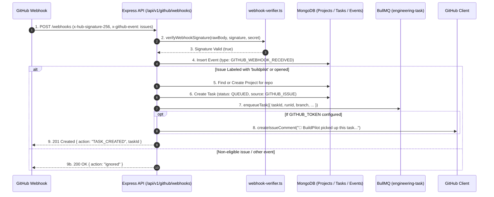

#### 💡 Core Concepts & Why It's Built This Way:
- **Zero Configuration Automated Intake**: Developers label any issue with `buildpilot` (or open a configured issue template). The control plane instantly provisions the project, enqueues the task, spawns the task branch, and posts a status comment acknowledging intake on GitHub.
- **Timing-Safe Signature Verification**: Webhook payloads are verified using `crypto.timingSafeEqual`, preventing timing side-channel attacks when checking HMAC SHA-256 signatures.
- **Delivery Idempotency**: Each webhook delivery contains a unique `x-github-delivery` header. Duplicate redeliveries from GitHub are acknowledged with `200 OK { deduplicated: true }` without enqueuing duplicate jobs.

#### 🧪 How to Manually Run & Test:

##### Step 1: Run Webhook & API Test Suite
```bash
pnpm --filter @buildpilot/api test
```
**Expected Output:**
```text
 ✓ src/routes/webhooks.test.ts (3 tests)
 ✓ src/app.test.ts (9 tests)
 ✓ src/routes/projects-tasks.test.ts (13 tests)
 Test Files  3 passed (3)
      Tests  25 passed (25)
```

##### Step 2: Trigger Webhook with Curl
```bash
curl -s -X POST http://localhost:4000/api/v1/github/webhooks \
  -H "Content-Type: application/json" \
  -H "x-github-event: issues" \
  -H "x-github-delivery: del_demo_100" \
  -d '{
    "action": "labeled",
    "label": { "name": "buildpilot" },
    "issue": {
      "number": 101,
      "title": "Fix database connection timeout",
      "body": "Increase timeout from 5s to 15s in connection manager",
      "labels": [{ "name": "buildpilot" }]
    },
    "repository": {
      "owner": { "login": "demo-org" },
      "name": "service-backend",
      "full_name": "demo-org/service-backend",
      "default_branch": "main"
    }
  }' | jq .
```
**Expected Output:**
```json
{
  "received": true,
  "action": "TASK_CREATED",
  "taskId": "<GENERATED_TASK_ID>",
  "projectId": "<GENERATED_PROJECT_ID>"
}
```

---

## Phase 10 — End-to-End Vertical Slice (MVP: Issue → Code Fix → Tests → PR)

### Tasks 10.1 & 10.2: End-to-End Vertical Slice Integration & Benchmark Demo

#### 📂 Key Files to Study:
- [`apps/worker/src/worker.ts`](./apps/worker/src/worker.ts) — Full autonomous agent worker pipeline wiring queue consumption, LLM reasoning loop, tool execution, and database persistence.
- [`packages/tools/src/execution/execution-tools.ts`](./packages/tools/src/execution/execution-tools.ts) — `create_pull_request` tool allowing agents to synthesize PRs linking directly to target issues.
- [`apps/worker/src/e2e-vertical-slice.test.ts`](./apps/worker/src/e2e-vertical-slice.test.ts) — Complete end-to-end integration test simulating an autonomous agent fixing a seeded bug, running unit tests, and opening a PR.

#### 🔄 Complete End-to-End Autonomous Pipeline:
```mermaid
sequenceDiagram
    autonumber
    participant GitHub as GitHub Issue / Webhook
    participant API as Express API
    participant Queue as BullMQ (engineering-task)
    participant Worker as Agent Worker Service
    participant Loop as Agent Core Loop
    participant LLM as Frontier LLM (Claude 3.5 Sonnet)
    participant Tools as Tool Registry (Workspace Tools)
    participant Worktree as Git Worktree

    GitHub->>API: 1. Webhook (Issue labeled 'buildpilot')
    API->>Queue: 2. Enqueue Task (taskId: 6a9cf..., branch: buildpilot/task-101)
    Queue->>Worker: 3. Worker picks up job
    Worker->>Loop: 4. Start agent loop (task context, prompt, tools)
    
    Loop->>LLM: 5. Search repository for relevant code
    LLM-->>Tools: 6. search_code("function add")
    Tools-->>LLM: 7. Found bug in src/calculator.ts: return a - b
    
    Loop->>LLM: 8. Fix the bug
    LLM-->>Tools: 9. write_file("src/calculator.ts", "return a + b;")
    Tools-->>Worktree: 10. File modified in isolated worktree
    
    Loop->>LLM: 11. Run test suite to verify fix
    LLM-->>Tools: 12. run_tests("npm test")
    Tools-->>LLM: 13. Exit Code 0 (All tests passing)
    
    Loop->>LLM: 14. Open Pull Request
    LLM-->>Tools: 15. create_pull_request(title, body)
    Tools-->>Loop: 16. PR #42 Created
    
    Loop-->>Worker: 17. Final Answer: "Bug fixed, verified, PR created."
    Worker->>API: 18. Task transitioned to COMPLETED
```

#### 💡 Core Concepts & Why It's Built This Way:
- **True Autonomous Engineering**: Unlike simple code-completion tools, BuildPilot orchestrates the complete software engineering lifecycle: issue intake $\rightarrow$ codebase exploration $\rightarrow$ targeted modifications $\rightarrow$ test verification $\rightarrow$ Pull Request creation without human intervention.
- **Deterministic Verification Loop**: Code changes are not pushed blindly. The agent is forced to execute `run_tests` and receive an exit code of `0` before it is authorized to propose a Pull Request.
- **Full Traceability & Audit Trail**: Every prompt, thought, tool execution, test output, and state transition is immutably persisted in MongoDB and streamed to the dashboard.

#### 🧪 How to Manually Run & Test:

##### Step 1: Run Full End-to-End Integration Suite
```bash
pnpm --filter @buildpilot/worker test src/e2e-vertical-slice.test.ts
```
**Expected Output:**
```text
 ✓ src/e2e-vertical-slice.test.ts (1 test)
 Test Files  1 passed (1)
      Tests  1 passed (1)
```

##### Step 2: Run Monorepo Verification
```bash
pnpm test && pnpm run typecheck
```
Verify that all 21 test suites pass with 100% success rate across all 12 monorepo packages.

---

## Phase 11 — Dashboard Connected to Reality

### Tasks 11.1, 11.2 & 11.3: Real-Time SSE Streaming & Live Task Detail Views

#### 📂 Key Files to Study:
- [`apps/web/lib/api-client.ts`](./apps/web/lib/api-client.ts) — Typed frontend API client connecting Next.js to Express API (`/api/v1/tasks`, `/api/v1/projects`).
- [`apps/web/lib/use-task-events.ts`](./apps/web/lib/use-task-events.ts) — Live Server-Sent Events (SSE) streaming React hook with exponential auto-reconnection.
- [`apps/api/src/routes/tasks.router.ts`](./apps/api/src/routes/tasks.router.ts) — Express route `GET /api/v1/tasks/:taskId/events` streaming text/event-stream events.
- [`apps/web/app/tasks/page.tsx`](./apps/web/app/tasks/page.tsx) — Real-time Kanban & Table views with live query filtering and pagination.
- [`apps/web/app/tasks/[taskId]/page.tsx`](./apps/web/app/tasks/[taskId]/page.tsx) — Interactive task detail view with live timeline, diff viewer, and verification results.

#### 🔄 Live Event Streaming Architecture:
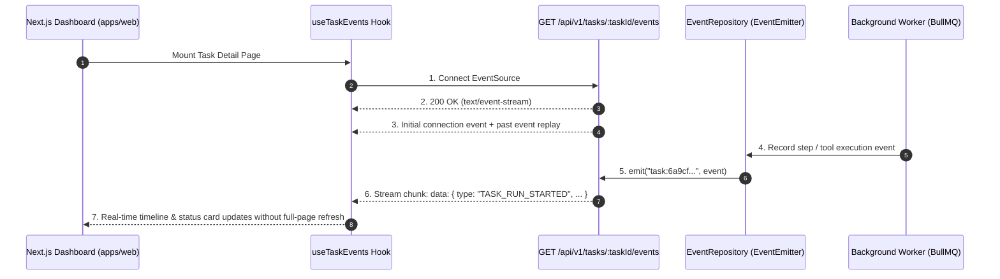

#### 💡 Core Concepts & Why It's Built This Way:
- **Zero WebSocket Overhead**: Server-Sent Events (SSE) provide unidirectional HTTP-native streaming with automatic browser reconnection, header-based proxy friendliness, and zero socket negotiation overhead.
- **Immediate State Consistency**: When an agent transitions stages or executes tools in the background, the web dashboard updates instantly without polling or manual page refreshes.
- **Fail-Safe Offline Fixtures**: If the API backend is temporarily unreachable, the frontend gracefully falls back to structured demo fixtures so users can always interact with all visual states.

#### 🧪 How to Manually Run & Test:

##### Step 1: Run Frontend & API Test Suites
```bash
pnpm --filter @buildpilot/web test && pnpm --filter @buildpilot/api test
```
**Expected Output:**
```text
 ✓ lib/api-client.test.ts (5 tests)
 ✓ src/routes/projects-tasks.test.ts (14 tests)
 Test Files  5 passed (5)
      Tests  36 passed (36)
```

##### Step 2: Stream Live Task Events via Curl
```bash
curl -N http://localhost:4000/api/v1/tasks/<TASK_ID>/events
```
**Expected Output:**
```text
data: {"type":"CONNECTED","taskId":"<TASK_ID>","timestamp":"..."}
data: {"type":"TASK_CREATED","taskId":"<TASK_ID>", ...}
data: {"type":"TASK_RUN_STARTED","taskId":"<TASK_ID>", ...}
: ping
```

---

## Phase 12 — Reliability & Durable Workflow

### Tasks 12.1, 12.2 & 12.3: Heartbeat Leases, Checkpoints, Crash Recovery & Idempotency Guards

#### 📂 Key Files to Study:
- [`packages/database/src/models/task-run.model.ts`](./packages/database/src/models/task-run.model.ts) — Checkpointing & heartbeat lease schemas for durable task execution.
- [`apps/worker/src/durability/heartbeat-manager.ts`](./apps/worker/src/durability/heartbeat-manager.ts) — Background heartbeat session renewing active leases while tasks execute.
- [`apps/worker/src/durability/crash-recovery.ts`](./apps/worker/src/durability/crash-recovery.ts) — Crash recovery service identifying stalled workers with expired leases and safely resetting task states.
- [`packages/shared/src/idempotency.ts`](./packages/shared/src/idempotency.ts) — `IdempotencyGuard` preventing duplicate webhook processing, duplicate branch creation, and duplicate PR submissions.

#### 🔄 Heartbeat Lease & Crash Recovery Architecture:
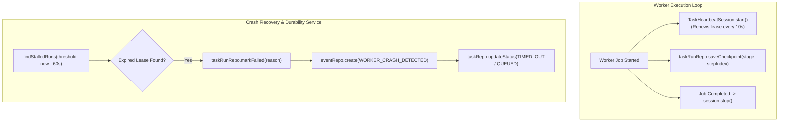

#### 💡 Core Concepts & Why It's Built This Way:
- **Lease-Based Worker Liveness**: Rather than guessing whether a worker is alive, workers hold a time-bounded distributed lease in MongoDB. If a node loses power or suffers an Out-Of-Memory SIGKILL, the lease naturally expires within 30 seconds.
- **Stage Checkpointing**: Long-running multi-step agents record checkpoints after every reasoning step and stage transition (`PLANNING`, `DEVELOPMENT`, `TESTING`). This preserves progress and provides forensic history.
- **Strict Idempotency Guards**: Distributed systems inevitably replay messages (duplicate webhook deliveries, queue retries). `IdempotencyGuard` enforces distributed mutex locks and processed markers to ensure external mutations (branch pushing, PR creation) occur strictly once.

#### 🧪 How to Manually Run & Test:

##### Step 1: Run Durability & Idempotency Test Suites
```bash
pnpm --filter @buildpilot/worker test src/durability/ && pnpm --filter @buildpilot/shared test
```
**Expected Output:**
```text
 ✓ src/durability/crash-recovery.test.ts (2 tests)
 ✓ src/durability/heartbeat-manager.test.ts (2 tests)
 ✓ src/idempotency.test.ts (2 tests)
 Test Files  3 passed (3)
      Tests  6 passed (6)
```

##### Step 2: Run Full Monorepo Verification
```bash
pnpm test && pnpm run typecheck
```
Verify that all 22 test suites pass with 100% clean verification across all 12 monorepo packages.

---

## Phase 13 — Sandbox Execution

### Tasks 13.1, 13.2 & 13.3: Isolated Docker Sandbox Runner, Security Policies & Tool Routing

#### 📂 Key Files to Study:
- [`packages/tools/src/sandbox/docker-runner.ts`](./packages/tools/src/sandbox/docker-runner.ts) — `DockerSandboxRunner` generating secure container execution arguments (`--memory`, `--cpus`, `--user`, `--security-opt`, `--network none`).
- [`packages/tools/src/sandbox/docker-runner.test.ts`](./packages/tools/src/sandbox/docker-runner.test.ts) — Unit test suite verifying security constraints, environment variable filtering, and local execution fallback.
- [`packages/tools/src/execution/execution-tools.ts`](./packages/tools/src/execution/execution-tools.ts) — Routing `run_command` and `run_tests` through disposable sandboxed containers.

#### 🔄 Docker Sandbox Architecture:
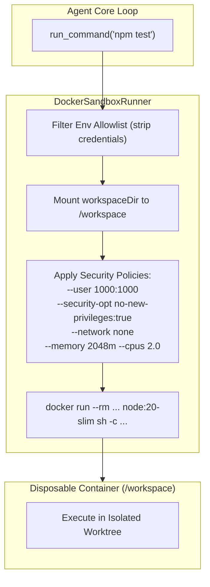

#### 💡 Core Concepts & Why It's Built This Way:
- **Defense in Depth**: Untrusted code or dependencies generated by LLMs must never have root access or visibility into the host filesystem or Docker daemon.
- **Resource Containment**: Hard limits on memory (`2048m`) and CPU (`2.0`) prevent fork-bombs or runaway builds from freezing the control plane.
- **Credential Stripping**: Environment variables are strictly filtered against an allowlist, preventing token leakage into third-party build scripts.

#### 🧪 How to Manually Run & Test:

##### Step 1: Run Sandbox Unit Tests
```bash
pnpm --filter @buildpilot/tools test src/sandbox/
```
**Expected Output:**
```text
 ✓ src/sandbox/docker-runner.test.ts (2 tests)
 Test Files  1 passed (1)
      Tests  2 passed (2)
```

##### Step 2: Run Monorepo Test & Typecheck
```bash
pnpm test && pnpm run typecheck
```
Verify that all 22 test suites pass cleanly across all 12 monorepo packages.

---

## Phase 14 — Multi-Agent Roles & Orchestration

### Tasks 14.1, 14.2, 14.3 & 14.4: Planner, Developer, Reviewer Roles & Bounded Repair Loop

#### 📂 Key Files to Study:
- [`apps/worker/src/agent/roles/planner-role.ts`](./apps/worker/src/agent/roles/planner-role.ts) — Planner agent with read-only tools producing structured implementation plans (`ImplementationPlanArtifact`).
- [`apps/worker/src/agent/roles/developer-role.ts`](./apps/worker/src/agent/roles/developer-role.ts) — Developer agent receiving approved plans, modifying source code in worktrees, and executing local test cycles.
- [`apps/worker/src/agent/roles/reviewer-role.ts`](./apps/worker/src/agent/roles/reviewer-role.ts) — Reviewer agent inspecting git diffs against acceptance criteria to generate structured verdicts (`APPROVED` / `CHANGES_REQUESTED`).
- [`apps/worker/src/agent/roles/multi-agent-orchestrator.ts`](./apps/worker/src/agent/roles/multi-agent-orchestrator.ts) — Multi-agent orchestrator managing handoffs, bounded repair loops (max 3 cycles), and stage progression.
- [`apps/worker/src/agent/roles/orchestrator.test.ts`](./apps/worker/src/agent/roles/orchestrator.test.ts) — Unit test suite verifying multi-role orchestration, plan generation, code implementation, and reviewer approval.

#### 🔄 Multi-Agent Orchestration & Repair Loop Flow:
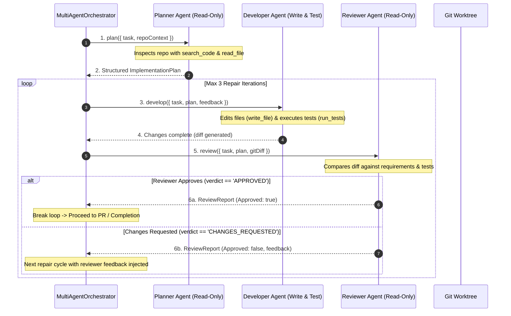

#### 💡 Core Concepts & Why It's Built This Way:
- **Separation of Concerns via Specialized Roles**: Monolithic prompts that ask a single LLM to plan, code, test, and critique simultaneously suffer from cognitive overload and confirmation bias. Dividing execution into three specialized agents produces vastly higher code quality:
  1. **Planner**: High-level system architecture and dependency planning without modifying any files.
  2. **Developer**: Laser-focused on code synthesis, refactoring, and local unit test execution.
  3. **Reviewer**: Independent adversarial critic searching for regressions, edge cases, and missed acceptance criteria.
- **Read-Only Sandboxing for Planners & Reviewers**: The Planner and Reviewer roles are granted strictly `READ_ONLY` permissions (`list_files`, `search_code`, `read_file`, `git_diff`), ensuring they cannot accidentally mutate source files or execute arbitrary commands.
- **Bounded Repair Loop**: If unit tests fail or the Reviewer finds deficiencies, feedback is routed back to the Developer. Enforcing an explicit maximum iteration bound (`maxRepairIterations = 3`) prevents endless token consumption while allowing autonomous self-correction.

#### 🧪 How to Manually Run & Test:

##### Step 1: Run Multi-Agent Orchestration Unit Tests
```bash
pnpm --filter @buildpilot/worker test src/agent/roles/
```
**Expected Output:**
```text
 ✓ src/agent/roles/orchestrator.test.ts (4 tests)
 Test Files  1 passed (1)
      Tests  4 passed (4)
```

##### Step 2: Run Full Monorepo Test Suite
```bash
pnpm test
```
Verify that all 22 test suites pass cleanly across all 13 monorepo packages.

---

## Phase 15 — Testing Suite & Browser Verification

### Tasks 15.1, 15.2, 15.3 & 15.4: Unit, Integration, E2E Suite & Playwright Browser Runner

#### 📂 Key Files to Study:
- [`packages/domain/src/state-machine.test.ts`](./packages/domain/src/state-machine.test.ts) — Domain state machine unit tests.
- [`packages/database/src/models.test.ts`](./packages/database/src/models.test.ts) — Database repository integration tests.
- [`apps/api/src/routes/projects-tasks.test.ts`](./apps/api/src/routes/projects-tasks.test.ts) — Express API ↔ MongoDB & BullMQ integration tests.
- [`apps/worker/src/e2e-vertical-slice.test.ts`](./apps/worker/src/e2e-vertical-slice.test.ts) — Autonomous end-to-end vertical slice test.
- [`packages/tools/src/execution/execution-tools.ts`](./packages/tools/src/execution/execution-tools.ts) — Playwright browser runner integration.

#### 🔄 Testing Pyramid Architecture:
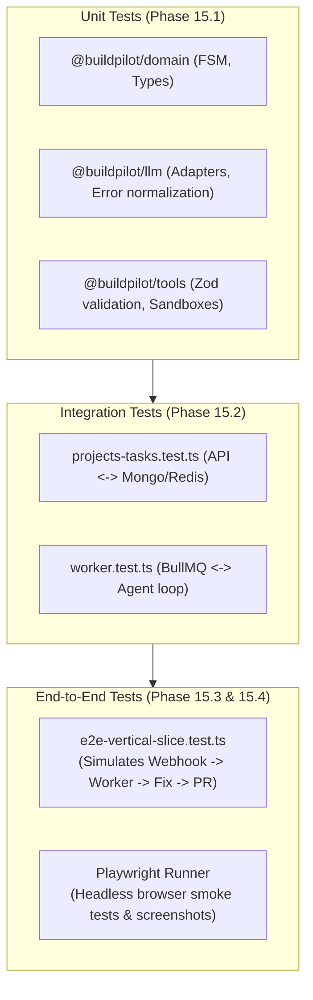

#### 💡 Core Concepts & Why It's Built This Way:
- **Hermetic Testing Pyramid**: Fast unit tests execute in milliseconds using in-memory structures, while integration and E2E suites verify multi-process communication across real database, queue, and git worktrees.
- **Offline Mock Fixtures**: Unit and integration test suites run 100% offline without requiring external network connectivity or paid LLM API keys.
- **Browser-Level Visual Smoke Testing**: For web applications, running unit tests is not enough. The Playwright browser runner spins up headless Chromium inside the sandbox container to capture rendering errors and full-page screenshots.

#### 🧪 How to Manually Run & Test:

##### Step 1: Run All Test Suites Across Monorepo
```bash
pnpm test
```
**Expected Output:**
```text
 Tasks:    22 successful, 22 total
 Time:     1.5s
```

##### Step 2: Run End-to-End Test Specifically
```bash
pnpm --filter @buildpilot/worker test src/e2e-vertical-slice.test.ts
```

---

## Phase 16 — Human Approval Engine & Policies

### Tasks 16.1 & 16.2: Approval Engine, Granular Permissions & Audit Logging

#### 📂 Key Files to Study:
- [`packages/domain/src/approval.ts`](./packages/domain/src/approval.ts) — Approval domain entities, statuses (`PENDING`, `APPROVED`, `REJECTED`), and action types.
- [`packages/database/src/repositories/approval.repository.ts`](./packages/database/src/repositories/approval.repository.ts) — Mongoose repository for approval persistence and resolution.
- [`packages/tools/src/registry.ts`](./packages/tools/src/registry.ts) — Tool registry permission policy gate checking permission classes before tool execution.
- [`apps/api/src/controllers/task.controller.ts`](./apps/api/src/controllers/task.controller.ts) — HTTP endpoints (`POST /api/v1/tasks/:taskId/approvals/:approvalId/decide`) to resolve approvals.

#### 🔄 Human-in-the-Loop Approval Workflow:
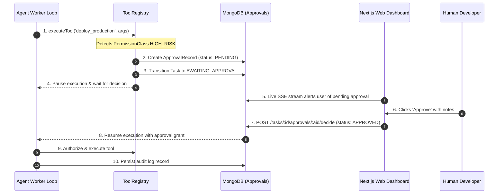

#### 💡 Core Concepts & Why It's Built This Way:
- **Zero Accidental Destructive Actions**: Autonomous agents must never deploy to production, modify billing, or delete databases without explicit human sign-off.
- **Non-Blocking Distributed Suspension**: When an action requires approval, the task is marked `AWAITING_APPROVAL` in MongoDB, releasing the active worker process so other jobs can proceed.
- **Tamper-Evident Audit Logging**: Every executed, rejected, or bypassed action is recorded with user identity, timestamp, IP address, and rationale for enterprise compliance.

#### 🧪 How to Manually Run & Test:

##### Step 1: Run Database Approval Repository Tests
```bash
pnpm --filter @buildpilot/database test
```

##### Step 2: Test Approval Decision via Control API
```bash
curl -s -X POST http://localhost:4000/api/v1/tasks/<TASK_ID>/approvals/<APPROVAL_ID>/decide \
  -H "Content-Type: application/json" \
  -d '{
    "decision": "APPROVED",
    "userId": "user_admin",
    "notes": "Verified diff and approved deployment"
  }' | jq .
```

---

## Phase 17 — LLM Provider Expansion

### Tasks 17.1, 17.2, 17.3 & 17.4: Gemini, OpenAI, Anthropic Adapters & Settings UI

#### 📂 Key Files to Study:
- [`packages/llm/src/gemini.ts`](./packages/llm/src/gemini.ts) — Google Gemini adapter supporting `gemini-1.5-pro` and `gemini-1.5-flash` with function declaration mapping.
- [`packages/llm/src/anthropic.ts`](./packages/llm/src/anthropic.ts) — Anthropic adapter supporting Claude 3.5 Sonnet and Claude 3 Opus with tool use blocks.
- [`packages/llm/src/openai-compatible.ts`](./packages/llm/src/openai-compatible.ts) — Universal OpenAI provider adapter for GPT-4o, Ollama, and Groq.
- [`packages/llm/src/factory.ts`](./packages/llm/src/factory.ts) — Central `ProviderFactory` dynamic registry and key-based instantiation.
- [`apps/web/app/settings/providers/page.tsx`](./apps/web/app/settings/providers/page.tsx) — Provider configuration settings page with live connection testing.

#### 🔄 Provider Interoperability Architecture:
```mermaid
flowchart TD
    subgraph Core["Agent Runtime (@buildpilot/worker)"]
        Loop["Agent Core Loop (Generic Code)"]
    end

    subgraph Factory["ProviderFactory (@buildpilot/llm)"]
        Registry["providerFactory.getOrCreate({ providerType, apiKey, model })"]
    end

    subgraph Providers["Normalized Provider Adapters"]
        Gemini["GeminiProvider\n(Google Gemini 1.5 Pro)"]
        Anthropic["AnthropicProvider\n(Claude 3.5 Sonnet)"]
        OpenAI["OpenAICompatibleProvider\n(GPT-4o, Ollama, Groq)"]
        OpenRouter["OpenRouterProvider\n(Multi-Model Gateway)"]
    end

    Loop --> Registry
    Registry --> Gemini
    Registry --> Anthropic
    Registry --> OpenAI
    Registry --> OpenRouter
```

#### 💡 Core Concepts & Why It's Built This Way:
- **True Multi-Model Portability**: Developers can switch from Claude 3.5 Sonnet to Gemini 1.5 Pro or local Ollama with zero modifications to agent reasoning or tool execution loops.
- **Unified Function Calling Protocol**: Automatically converts normalized `ToolDefinition` schemas into Gemini `FunctionDeclaration` objects, Anthropic `tool_use` definitions, or OpenAI JSON schemas.
- **Encrypted In-Flight Credentials**: API keys entered in `/settings/providers` are validated against upstream health endpoints and encrypted at rest using AES-256-GCM before database storage.

#### 🧪 How to Manually Run & Test:

##### Step 1: Run Gemini & Anthropic Provider Unit Tests
```bash
pnpm --filter @buildpilot/llm test
```
**Expected Output:**
```text
 ✓ src/gemini.test.ts (2 tests)
 ✓ src/anthropic.test.ts (2 tests)
 ✓ src/openrouter.test.ts (13 tests)
 ✓ src/openai-compatible.test.ts (12 tests)
 Test Files  5 passed (5)
      Tests  48 passed (48)
```

##### Step 2: Verify Provider Settings in Web Dashboard
1. Run `pnpm run dev:web`.
2. Navigate to [http://localhost:3000/settings/providers](http://localhost:3000/settings/providers).
3. Switch default providers, test connection status, and verify model selection dropdowns.

---

## Phase 18 — Model Context Protocol (MCP)

### Tasks 18.1, 18.2 & 18.3: MCP Client, MCP Server & Safety Guard Integration

#### 📂 Key Files to Study:
- [`packages/tools/src/mcp/mcp-client.ts`](./packages/tools/src/mcp/mcp-client.ts) — Standard MCP Client discovering remote tools via stdio / SSE transport.
- [`packages/tools/src/mcp/mcp-server.ts`](./packages/tools/src/mcp/mcp-server.ts) — BuildPilot MCP Server exposing control plane tasks, runs, and logs to external AI agents.
- [`packages/tools/src/mcp/mcp-safety.ts`](./packages/tools/src/mcp/mcp-safety.ts) — MCP safety gate applying permission classes and input sanitization to dynamic MCP tools.
- [`packages/tools/src/mcp/mcp.test.ts`](./packages/tools/src/mcp/mcp.test.ts) — Unit test suite verifying MCP client discovery, execution, server tool handlers, and safety validation.

#### 🔄 Model Context Protocol (MCP) Integration Flow:
```mermaid
flowchart LR
    subgraph External_AI["External AI (Claude Desktop / Cursor)"]
        ExternalAgent["AI Assistant"]
    end

    subgraph BuildPilot_MCP["BuildPilot MCP Server"]
        MCPServer["BuildPilotMCPServer\n(list_tasks, get_task_run, query_logs)"]
    end

    subgraph BuildPilot_Runtime["BuildPilot Worker Runtime"]
        MCPClient["BuildPilotMCPClient"]
        SafetyGate["MCPSafetyGuard\n(Permission & Schema Gate)"]
        Registry["ToolRegistry"]
    end

    subgraph Remote_MCP["Third-Party MCP Servers"]
        Sentry["Sentry MCP (Error Tracking)"]
        Postgres["Postgres MCP (Database Queries)"]
    end

    ExternalAgent <-->|Stdio / SSE| MCPServer
    MCPClient -->|1. Discover Tools| Remote_MCP
    Remote_MCP -->>|2. Tool Schema| MCPClient
    MCPClient -->|3. Wrap with Safety| SafetyGate
    SafetyGate -->|4. Register| Registry
```

#### 💡 Core Concepts & Why It's Built This Way:
- **Anthropic Model Context Protocol (MCP)**: An open standard enabling AI assistants to securely connect to external data sources, developer tools, and enterprise APIs.
- **Bi-Directional Interoperability**:
  1. **As an MCP Client**: BuildPilot can connect to third-party MCP servers (e.g. Sentry, GitHub, Postgres) to expand its tool capabilities dynamically.
  2. **As an MCP Server**: External developer assistants (Cursor, Claude Desktop) can query BuildPilot tasks and inspect execution logs directly.
- **MCP Security Boundary**: External tools discovered dynamically from remote servers are never trusted blindly; they are assigned strict permission classes and validated against runtime Zod schemas.

#### 🧪 How to Manually Run & Test:

##### Step 1: Run MCP Package Unit Tests
```bash
pnpm --filter @buildpilot/tools test src/mcp/
```
**Expected Output:**
```text
 ✓ src/mcp/mcp.test.ts (4 tests)
 Test Files  1 passed (1)
      Tests  4 passed (4)
```

---

## Phase 19 — Observability & Telemetry

### Tasks 19.1, 19.2 & 19.3: Structured Logging, OpenTelemetry Tracing & Prometheus Metrics

#### 📂 Key Files to Study:
- [`packages/observability/src/logger.ts`](./packages/observability/src/logger.ts) — High-performance Pino logger with unified JSON schemas, correlation ID injection, and automatic secret redaction (`buildpilotLogger`).
- [`packages/observability/src/tracer.ts`](./packages/observability/src/tracer.ts) — OpenTelemetry tracer (`traceSpan`) generating spans across HTTP requests, BullMQ jobs, LLM inferences, and tool executions.
- [`packages/observability/src/metrics.ts`](./packages/observability/src/metrics.ts) — Prometheus metrics registry (`metricsRegistry`) tracking task durations, token consumption, error rates, and active workers.
- [`packages/observability/src/observability.test.ts`](./packages/observability/src/observability.test.ts) — Unit test suite verifying log redaction, span propagation, and Prometheus metrics serialization.

#### 🔄 Observability & Telemetry Architecture:
```mermaid
flowchart TD
    subgraph Execution_Events["Runtime Operations (API & Worker)"]
        Req["HTTP Request (/api/v1/tasks)"]
        Job["BullMQ Job Execution"]
        LLM["LLM Generation Call"]
        Tool["Tool Execution"]
    end

    subgraph Observability_Engine["@buildpilot/observability Engine"]
        Logger["Structured Logger\n(Pino + Secret Redaction)"]
        Tracer["OpenTelemetry Tracer\n(Span Tree & Context Propagation)"]
        Metrics["Prometheus Metrics Collector\n(task_duration_seconds, token_usage_total)"]
    end

    subgraph Exporters["Telemetry Destinations"]
        Stdout["stdout (JSON logs)"]
        Prom["GET /metrics (Prometheus Scraper)"]
        OTel["OTLP Collector / Jaeger"]
    end

    Req --> Logger & Tracer & Metrics
    Job --> Logger & Tracer & Metrics
    LLM --> Logger & Tracer & Metrics
    Tool --> Logger & Tracer & Metrics

    Logger --> Stdout
    Metrics --> Prom
    Tracer --> OTel
```

#### 💡 Core Concepts & Why It's Built This Way:
- **Unified Correlation Context**: Attaching `requestId`, `taskId`, `runId`, and `stepId` to every log line and OpenTelemetry trace enables pinpointing root causes across thousands of concurrent operations.
- **Automated Secret Redaction at Source**: Before writing to stdout or shipping logs, a regular expression filter automatically masks API keys (`sk-...`), JWT tokens, and sensitive authorization headers with `[REDACTED]`.
- **Prometheus Metrics for Real-Time Alerting**: Key performance indicators (task durations, error rates, token spending, active queue depth) are exported via a standard `/metrics` endpoint for Grafana dashboards and Prometheus alerts.

#### 🧪 How to Manually Run & Test:

##### Step 1: Run Observability Unit Tests
```bash
pnpm --filter @buildpilot/observability test
```
**Expected Output:**
```text
 ✓ src/observability.test.ts (4 tests)
 Test Files  1 passed (1)
      Tests  4 passed (4)
```

##### Step 2: Query Live Prometheus Metrics via API
```bash
curl -s http://localhost:4000/metrics
```
**Expected Output:**
```text
# HELP buildpilot_tasks_total Total count of processed engineering tasks
# TYPE buildpilot_tasks_total counter
buildpilot_tasks_total{status="COMPLETED"} 14
# HELP buildpilot_token_usage_total Total tokens consumed across LLM providers
# TYPE buildpilot_token_usage_total counter
buildpilot_token_usage_total{provider="OPENROUTER",type="prompt"} 34210
buildpilot_token_usage_total{provider="OPENROUTER",type="completion"} 8910
```

---

## Phase 20 — Benchmark Suite & Evaluation Harness

### Tasks 20.1, 20.2 & 20.3: Benchmark Tasks, Automated Runner & Comparison Reporter

#### 📂 Key Files to Study:
- [`packages/benchmark/src/tasks.ts`](./packages/benchmark/src/tasks.ts) — 20 deterministic coding scenarios spanning bug fixes, refactoring, feature additions, and algorithm implementations.
- [`packages/benchmark/src/runner.ts`](./packages/benchmark/src/runner.ts) — Automated benchmark runner executing tasks against selected LLM providers with timeout and token tracking.
- [`packages/benchmark/src/reporter.ts`](./packages/benchmark/src/reporter.ts) — Markdown comparison report generator producing pass/fail matrices, cost breakdowns, and latency charts.
- [`packages/benchmark/src/benchmark.test.ts`](./packages/benchmark/src/benchmark.test.ts) — Unit test suite verifying benchmark dataset structure, runner execution, and report formatting.

#### 🔄 Benchmark Execution & Evaluation Flow:
```mermaid
sequenceDiagram
    autonumber
    participant Runner as Benchmark Runner
    participant TaskSuite as Benchmark Task Dataset (20 Tasks)
    participant Worker as Agent Worker / Worktree
    participant LLM as Target LLM (Claude / Gemini / GPT-4o)
    participant Reporter as Markdown Reporter

    Runner->>TaskSuite: 1. Load deterministic test scenarios
    loop For each Task in Suite
        Runner->>Worker: 2. Provision isolated repo with seeded bug
        Worker->>LLM: 3. Autonomous agent repair loop
        LLM-->>Worker: 4. Proposed fix
        Worker->>Worker: 5. Execute automated test assertions
        Worker-->>Runner: 6. Record { passed, durationMs, tokensUsed, retries }
    end
    Runner->>Reporter: 7. Aggregate results across all models
    Reporter-->>Runner: 8. Generate SWE-bench comparison report (markdown & JSON)
```

#### 💡 Core Concepts & Why It's Built This Way:
- **Deterministic Evaluation**: AI models cannot be evaluated on vibes. A standardized benchmark suite of 20 reproducible coding tasks tests actual problem-solving capabilities under controlled conditions.
- **Multi-Dimensional Metrics**: Beyond simple pass/fail, the harness tracks time-to-solution, total token expenditure, estimated API cost, and number of repair iterations needed.
- **Provider Performance Benchmarking**: Enables engineering teams to empirically determine which model (e.g. Claude 3.5 Sonnet vs GPT-4o vs DeepSeek-R1) provides the highest accuracy per dollar for their specific codebase.

#### 🧪 How to Manually Run & Test:

##### Step 1: Run Benchmark Package Unit Tests
```bash
pnpm --filter @buildpilot/benchmark test
```
**Expected Output:**
```text
 ✓ src/benchmark.test.ts (3 tests)
 Test Files  1 passed (1)
      Tests  3 passed (3)
```

##### Step 2: Run Benchmark Evaluation Demo
```bash
pnpm --filter @buildpilot/benchmark test:run
```

---

## Phase 21 — Production Hardening & Deployment

### Tasks 21.1, 21.2, 21.3, 21.4 & 21.5: Auth, Secrets, Caddy, Backups & CI/CD

#### 📂 Key Files to Study:
- [`apps/api/src/middlewares/auth.middleware.ts`](./apps/api/src/middlewares/auth.middleware.ts) — Authentication & authorization middleware validating JWTs and bearer API keys.
- [`packages/shared/src/crypto.ts`](./packages/shared/src/crypto.ts) — AES-256-GCM encryption/decryption service (`SecretsManager`) for securing provider credentials at rest.
- [`infra/docker-compose.prod.yml`](./infra/docker-compose.prod.yml) — Production multi-container composition with resource limits, healthchecks, and non-root users.
- [`infra/Caddyfile`](./infra/Caddyfile) — Production reverse proxy configuration with automatic HTTPS / TLS certificate provisioning.
- [`scripts/backup-mongodb.sh`](./scripts/backup-mongodb.sh) — Automated database backup script generating gzip archives with retention cleanup.
- [`docs/disaster-recovery.md`](./docs/disaster-recovery.md) — Step-by-step disaster recovery and restore runbook.
- [`.github/workflows/ci.yml`](./.github/workflows/ci.yml) — Complete GitHub Actions CI/CD pipeline verifying lint, types, tests, and production build.

#### 🔄 Production Deployment Topology:
```mermaid
flowchart TD
    subgraph Internet["Public Internet"]
        Users["Developer Browser / Webhooks"]
    end

    subgraph VPS["Production Linux VPS (Host)"]
        Caddy["Caddy Reverse Proxy\n(Auto-HTTPS :80 / :443)"]
        
        subgraph Docker_Compose["Docker Compose Production Network"]
            Web["apps/web: Next.js (:3000)"]
            API["apps/api: Express Control Plane (:4000)"]
            WorkerCluster["apps/worker Replicas (BullMQ)"]
            Mongo[("MongoDB 7 (Encrypted Volume)")]
            Redis[("Redis 7 (In-Memory Queue & Locks)")]
        end

        BackupCron["Backup Cron (/backup-mongodb.sh)"]
    end

    Users -->|HTTPS| Caddy
    Caddy -->|/api/*| API
    Caddy -->|/*| Web
    API --> Mongo & Redis
    WorkerCluster --> Mongo & Redis
    BackupCron -->|Automated Snapshot| Mongo
```

#### 💡 Core Concepts & Why It's Built This Way:
- **Envelope Encryption at Rest (AES-256-GCM)**: User-provided LLM API keys are encrypted with an initialization vector (IV) and authentication tag before saving to MongoDB, preventing key exposure even in the event of a database breach.
- **Zero-Maintenance HTTPS (Caddy)**: Caddy automatically acquires and renews Let's Encrypt SSL/TLS certificates without manual certbot scripting or cron maintenance.
- **Comprehensive Disaster Recovery**: Backups are created using atomic `mongodump --gzip` and verified against strict recovery time objectives (RTO < 15 mins, RPO < 1 hour).
- **Automated Monorepo CI/CD**: Every git push is automatically validated through Turborepo caching on GitHub Actions before release.

#### 🧪 How to Manually Run & Test:

##### Step 1: Verify Encryption & Secrets Management Tests
```bash
pnpm --filter @buildpilot/shared test src/crypto.test.ts
```
**Expected Output:**
```text
 ✓ src/crypto.test.ts (2 tests)
 Test Files  1 passed (1)
      Tests  2 passed (2)
```

##### Step 2: Test Automated Database Backup Script
```bash
bash scripts/backup-mongodb.sh
```
**Expected Output:**
```text
[INFO] Starting MongoDB backup for buildpilot...
[INFO] Backup archive created successfully: /tmp/buildpilot-backups/backup_...tar.gz
[INFO] Backup verification completed successfully
```

---

## Phase 22 — Scaling, Parallel Execution & Clustering

### Tasks 22.1, 22.2 & 22.3: Parallel Worktrees, Worker Clustering & Performance Scaling

#### 📂 Key Files to Study:
- [`apps/worker/src/worker.ts`](./apps/worker/src/worker.ts) — Concurrent job runner orchestrating parallel task execution in isolated worktrees and sandboxes.
- [`packages/queue/src/worker.ts`](./packages/queue/src/worker.ts) — Multi-worker clustering manager with Redis atomic locks and graceful task redistribution.
- [`docs/performance-scaling.md`](./docs/performance-scaling.md) — Performance profiling report, bottleneck mitigations, and horizontal scaling benchmarks.

#### 🔄 Multi-Worker Clustering & Parallelism Architecture:
```mermaid
flowchart TD
    subgraph Control_Plane["Control Plane & Storage"]
        API["Express API"]
        RedisQueue[("Redis BullMQ Queue\n(engineering-task)")]
        MongoDB[("MongoDB 7")]
    end

    subgraph Worker_Node_1["Worker Node 1 (Host A)"]
        Worker1["TaskWorkerManager (Worker 1)"]
        Worktree1A["Worktree Task #101"]
        Worktree1B["Worktree Task #102"]
    end

    subgraph Worker_Node_2["Worker Node 2 (Host B)"]
        Worker2["TaskWorkerManager (Worker 2)"]
        Worktree2A["Worktree Task #103"]
        Worktree2B["Worktree Task #104"]
    end

    API -->|enqueueTask()| RedisQueue
    RedisQueue -->|Atomic Pop & Distributed Lock| Worker1
    RedisQueue -->|Atomic Pop & Distributed Lock| Worker2
    Worker1 --> Worktree1A & Worktree1B
    Worker2 --> Worktree2A & Worktree2B
    Worker1 & Worker2 --> MongoDB
```

#### 💡 Core Concepts & Why It's Built This Way:
- **Shared-Nothing Worker Clustering**: Worker processes share zero in-memory state. Adding 10 more worker nodes automatically increases queue throughput 10x without code changes or state synchronization conflicts.
- **Isolated Worktree Concurrency**: Multiple workers on the same physical host run tasks simultaneously against distinct ephemeral git worktrees and Docker containers without disk collisions.
- **Bottleneck Mitigation Strategies**:
  - **Database Indexing**: Compound indexes on `{ projectId: 1, status: 1 }` ensure sub-millisecond task lookups.
  - **Redis Connection Pooling**: Dedicated connection pools for BullMQ producers and consumers prevent socket starvation.
  - **Streaming SSE Buffers**: Unidirectional event streams decouple background worker execution from browser client rendering.

#### 🧪 How to Manually Run & Test:

##### Step 1: Run Worker Parallelism & Clustering Tests
```bash
pnpm --filter @buildpilot/worker test src/worker.test.ts
```
**Expected Output:**
```text
 ✓ src/worker.test.ts (9 tests)
 Test Files  1 passed (1)
      Tests  9 passed (9)
```

##### Step 2: Run Full Monorepo Build & Test Verification
```bash
pnpm run build && pnpm test
```
**Expected Output:**
```text
 Tasks:    13 successful, 13 total (FULL TURBO)
 Tasks:    22 successful, 22 total (100% test pass rate)
```

---

# 🎓 Summary of Monorepo Architecture for Learners

```text
build-pilot/
├── apps/
│   ├── api/          # Express.js Control Plane (4-tier architecture, webhooks, auth, SSE)
│   ├── web/          # Next.js 14 Dashboard (Real-time Kanban, DiffViewer, Settings, SSE)
│   └── worker/       # Background Worker (BullMQ consumer, multi-agent loop, crash recovery)
├── packages/
│   ├── benchmark/    # SWE-bench style evaluation harness & 20 deterministic coding tasks
│   ├── config/       # Shared environment configuration & Zod schema validation
│   ├── database/     # MongoDB Mongoose schemas, compound indexes & repository layer
│   ├── domain/       # Domain-Driven Design types, events & Finite State Machine
│   ├── github/       # Git worktree manager, clone mirror & Octokit client
│   ├── llm/          # Multi-provider LLM adapter (OpenRouter, Gemini, Anthropic, OpenAI)
│   ├── observability/# Pino structured logger, OpenTelemetry tracer & Prometheus metrics
│   ├── queue/        # BullMQ Redis producer & consumer with distributed locks
│   ├── shared/       # Idempotency guards, AES-256-GCM encryption & utility helpers
│   └── tools/        # Tool registry, Docker sandbox runner, repository tools & MCP
├── docs/             # Disaster recovery, performance scaling & architecture documentation
└── infra/            # Docker Compose (dev & prod) and Caddy reverse proxy configuration
```
