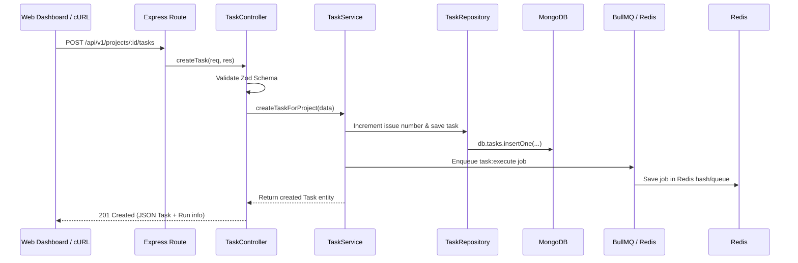

# BuildPilot — Manual Testing & Learning Guide 🧑‍💻📚

> **Hands-on verification and rapid engineering learning guide for BuildPilot.**
> For each task, this guide breaks down:
> 1. 📂 **Key Files to Study** — Exactly which source files to read to understand the implementation.
> 2. 🔄 **Execution & Data Flow** — How data flows across processes, databases, and layers.
> 3. 💡 **Core Concepts & Why It's Built This Way** — Software design patterns, enterprise tradeoffs, and best practices.
> 4. 🧪 **How to Manually Run & Test** — Copy-pasteable CLI commands and expected outputs.

---

## 📋 Table of Contents

- [Phase 0 — Infrastructure & Monorepo](#phase-0--infrastructure--monorepo)
  - [Task 0.1: Monorepo & Build Toolchain](#task-01-monorepo--scripts)
  - [Task 0.2: Container Infrastructure (MongoDB & Redis)](#task-02-docker-infrastructure-mongodb--redis)
- [Phase 1 — Web Dashboard Shell & Domain Types](#phase-1--web-dashboard-shell--domain-types)
  - [Task 1.1: Next.js Web Dashboard](#task-11-nextjs-web-dashboard)
  - [Task 1.2: Domain Types & Finite State Machine](#task-12-domain-types--state-machine)
- [Phase 2 — Database Layer](#phase-2--database-layer)
  - [Task 2.1: MongoDB Connection Manager](#task-21-mongodb-connection-manager)
  - [Task 2.2: Mongoose Models & Repositories](#task-22-mongoose-models--repositories)
- [Phase 3 — Control API](#phase-3--control-api)
  - [Task 3.1: Express Application Shell & Correlation Tracing](#task-31-express-application-shell)
  - [Task 3.2: Task & Project API (4-Tier Architecture)](#task-32-task--project-api-4-tier-architecture)
- [Phase 4 — Queue + Worker](#phase-4--queue--worker)
  - [Task 4.1: Redis + BullMQ Queue Engine](#task-41-redis--bullmq-queue-setup)

---

## Phase 0 — Infrastructure & Monorepo

### Task 0.1: Monorepo & Scripts

#### 📂 Key Files to Study:
- [`package.json`](./package.json) — Monorepo root scripts, dependencies, and workspace engines.
- [`pnpm-workspace.yaml`](./pnpm-workspace.yaml) — Defines the `apps/*` and `packages/*` workspace glob topology.
- [`turbo.json`](./turbo.json) — Turborepo task pipeline (`build`, `test`, `lint`, `typecheck`) with caching dependencies (`^build`).
- [`tsconfig.base.json`](./tsconfig.base.json) — Shared strict TypeScript compiler configuration.

#### 🔄 Architecture Flow:
```text
Root Monorepo (pnpm + turborepo)
   ├── packages/ (domain, database, queue, observability, config, tools, github, llm)
   └── apps/     (web: Next.js, api: Express, worker: BullMQ)
```

#### 💡 Core Concepts & Why It's Built This Way:
- **Pnpm Workspaces**: Uses symlinked node_modules with content-addressable storage, saving disk space and ensuring 100% deterministic dependency resolution.
- **Turborepo Dependency Graph (`^build`)**: Tells Turborepo to build upstream packages (like `@buildpilot/domain` and `@buildpilot/database`) before building downstream consumers (like `@buildpilot/api` or `@buildpilot/web`).
- **Shared Compiler Target**: Setting `NodeNext` and strict typechecking across all sub-packages ensures types match seamlessly when imported across packages.

#### 🧪 How to Manually Run & Test:
```bash
# 1. Verify TypeScript compiles across all 12 packages
pnpm run typecheck

# 2. Run ESLint across all workspaces
pnpm run lint

# 3. Build all packages in parallel (observe Turbo caching)
pnpm run build
```

---

### Task 0.2: Docker Infrastructure (MongoDB & Redis)

#### 📂 Key Files to Study:
- [`infra/docker-compose.yml`](./infra/docker-compose.yml) — Multi-container definition for MongoDB 7 and Redis 7 with healthchecks and persistent volumes.
- [`.env.example`](./.env.example) — Standardized environment variable template.

#### 🔄 Architecture Flow:
```text
Host Machine (Node.js apps)
   ├── mongodb://localhost:27017 ──> Docker Container (buildpilot-mongodb: persistent volume)
   └── redis://localhost:6379   ──> Docker Container (buildpilot-redis: in-memory cache & queues)
```

#### 💡 Core Concepts & Why It's Built This Way:
- **Separation of Concerns**: MongoDB handles relational/document persistence (Tasks, Projects, Runs, Logs), while Redis handles high-throughput in-memory job queues and inter-process locking.
- **Docker Healthchecks**: The API and Worker services depend on databases being fully initialized. Docker healthchecks (`mongosh --eval "db.adminCommand('ping')"` and `redis-cli ping`) prevent starting app servers before DBs are ready.

#### 🧪 How to Manually Run & Test:
```bash
# 1. Start MongoDB & Redis containers in background
docker compose -f infra/docker-compose.yml up -d

# 2. Check container health status
docker compose -f infra/docker-compose.yml ps

# 3. Inspect Redis directly
docker exec -it buildpilot-redis redis-cli ping
# Expected response: PONG

# 4. Inspect MongoDB directly
docker exec -it buildpilot-mongodb mongosh --eval "db.adminCommand('ping')"
# Expected response: { ok: 1 }
```

---

## Phase 1 — Web Dashboard Shell & Domain Types

### Task 1.1: Next.js Web Dashboard

#### 📂 Key Files to Study:
- [`apps/web/src/app/layout.tsx`](./apps/web/src/app/layout.tsx) — Root layout with responsive navigation sidebar and top header.
- [`apps/web/src/app/dashboard/page.tsx`](./apps/web/src/app/dashboard/page.tsx) — Main control plane dashboard with real-time stats and execution charts.
- [`apps/web/src/app/tasks/page.tsx`](./apps/web/src/app/tasks/page.tsx) — 15-state Kanban task board.
- [`apps/web/src/components/DiffViewer.tsx`](./apps/web/src/components/DiffViewer.tsx) — Syntax-highlighted patch and Git diff reviewer.

#### 🔄 UI Navigation Flow:
```text
/ (Home) ──> /dashboard (Metrics & Quick Actions)
          ──> /projects  (Repository Management)
          ──> /tasks     (Kanban Board: Queued -> In-Progress -> Awaiting Approval -> Completed)
          ──> /tasks/:id (Live Step Logs, Diff Viewer, Human Approval Actions)
          ──> /settings  (LLM Provider Keys: OpenRouter, Anthropic, OpenAI)
```

#### 💡 Core Concepts & Why It's Built This Way:
- **Server Components + Client Components**: Next.js App Router allows rendering static layout skeletons on the server while keeping interactive elements (diff viewers, modals, kanban drag/drop) fast and reactive on the client.
- **Human-in-the-Loop AI UX**: Engineering agents generate code diffs that require human approval before git push. The `DiffViewer` and `/tasks/:id` detail page are designed specifically for developer review.

#### 🧪 How to Manually Run & Test:
```bash
pnpm run dev:web
```
**Action:** Open [http://localhost:3000](http://localhost:3000) in your browser:
- Check `/dashboard`, `/projects`, `/tasks`, and `/settings/providers`.
- Toggle themes, test responsive sidebar collapse, and inspect task status badges.

---

### Task 1.2: Domain Types & State Machine

#### 📂 Key Files to Study:
- [`packages/domain/src/task.ts`](./packages/domain/src/task.ts) — 15 Task states, Task priorities, and data schemas.
- [`packages/domain/src/events.ts`](./packages/domain/src/events.ts) — 20+ strongly-typed system event schemas.
- [`packages/domain/src/state-machine.ts`](./packages/domain/src/state-machine.ts) — Task lifecycle Finite State Machine (`TaskStateMachine`, `ALLOWED_TASK_TRANSITIONS`).

#### 🔄 State Machine Lifecycle:
```text
QUEUED ──> PLANNING ──> CODING ──> TESTING ──> AWAITING_APPROVAL ──> COMPLETED
   │           │           │          │               │
   └───> FAILED / CANCELLED / BLOCKED ◄────────────────┘
```

#### 💡 Core Concepts & Why It's Built This Way:
- **Finite State Machine (FSM)**: Long-running AI agents can fail at any point (LLM rate limit, syntax error, failed unit tests). An FSM guarantees that tasks can only move through verified paths (e.g. you cannot jump from `QUEUED` directly to `COMPLETED`).
- **Domain-Driven Design (DDD)**: By placing domain entities in `@buildpilot/domain`, both the frontend Next.js app and the backend API import the exact same TypeScript types and validation schemas.

#### 🧪 How to Manually Run & Test:
```bash
pnpm --filter @buildpilot/domain test
```
**What you learn:** Observe how `TaskStateMachine.transition(task, 'COMPLETED')` throws `InvalidStateTransitionError` when called on a task that is currently in `QUEUED` state.

---

## Phase 2 — Database Layer

### Task 2.1: MongoDB Connection Manager

#### 📂 Key Files to Study:
- [`packages/database/src/connection.ts`](./packages/database/src/connection.ts) — `DatabaseManager` singleton with connection retry logic, pool sizing, and latency ping.
- [`packages/database/src/errors.ts`](./packages/database/src/errors.ts) — Custom typed database errors (`DatabaseConnectionError`, `EntityNotFoundError`).

#### 🔄 Connection Lifecycle Flow:
```text
connectToDatabase({ uri })
   ├── Validate URI format (Zod)
   ├── Establish Mongoose connection (poolSize: 10, serverSelectionTimeoutMS: 5000)
   ├── Attach process listeners (SIGINT/SIGTERM -> graceful disconnect)
   └── healthCheck() -> ping latency ms + connection state (0: disconnected, 1: connected)
```

#### 💡 Core Concepts & Why It's Built This Way:
- **Connection Pooling**: Managing a pool of persistent TCP sockets avoids the massive latency overhead of opening a new MongoDB connection on every incoming HTTP request.
- **Graceful Shutdown**: When a container receives `SIGTERM`, it closes pending queries before exiting to prevent database document corruption.

#### 🧪 How to Manually Run & Test:
```bash
pnpm --filter @buildpilot/database test src/index.test.ts
```

---

### Task 2.2: Mongoose Models & Repositories

#### 📂 Key Files to Study:
- [`packages/database/src/models/`](./packages/database/src/models) — 16 Mongoose Schemas (`TaskModel`, `ProjectModel`, `TaskRunModel`, `EventModel`, `AgentStepModel`, etc.).
- [`packages/database/src/repositories/`](./packages/database/src/repositories) — Type-safe repository abstraction layer (`TaskRepository`, `ProjectRepository`, `EventRepository`).
- [`packages/database/src/models/task.model.ts`](./packages/database/src/models/task.model.ts) — Task Mongoose schema, compound indexes, and interface bindings.
- [`packages/database/src/repositories/task.repository.ts`](./packages/database/src/repositories/task.repository.ts) — Type-safe repository abstraction layer for task mutations and atomic state queries.

#### 🔄 Repository Pattern Flow:
```text
API Controller / Service
       │ (calls clean domain methods: findById, updateStatus, createWithRun)
       ▼
TaskRepository (Hides Mongoose specifics)
       │ (runs schema validation, compound indexes, timestamps)
       ▼
MongoDB Database Engine
```

#### 💡 Core Concepts & Why It's Built This Way:
- **Repository Pattern**: Never write raw database queries (`TaskModel.findOneAndUpdate(...)`) inside HTTP controllers. Encapsulating queries inside repository classes allows changing the underlying DB or mocking data in unit tests effortlessly.
- **Compound Database Indexes**: Queries like `db.tasks.find({ projectId: "xyz", status: "QUEUED" })` use compound index `{ projectId: 1, status: 1 }` to scan only matching index pointers instead of performing full table scans.

#### 🧪 How to Manually Run & Test:
```bash
pnpm --filter @buildpilot/database test src/models.test.ts
```

---

## Phase 3 — Control API

### Task 3.1: Express Application Shell & Correlation Tracing

#### 📂 Key Files to Study:
- [`apps/api/src/server.ts`](./apps/api/src/server.ts) — Server entrypoint, environment bootloader, and graceful signal handling.
- [`apps/api/src/app.ts`](./apps/api/src/app.ts) — Express middleware pipeline setup.
- [`apps/api/src/middleware/correlation.middleware.ts`](./apps/api/src/middleware/correlation.middleware.ts) — Injects and propagates `x-correlation-id`.
- [`apps/api/src/middleware/error.middleware.ts`](./apps/api/src/middleware/error.middleware.ts) — Global error handler mapping domain errors to HTTP status codes.

#### 🔄 HTTP Request Pipeline:
```text
Incoming HTTP Request
   │
   ▼
1. Correlation Middleware (Extracts or generates UUID `x-correlation-id`)
   │
   ▼
2. Request Logger Middleware (Pino structured log with correlation ID)
   │
   ▼
3. Security & Parser Middleware (Helmet, CORS, JSON Body Parser)
   │
   ▼
4. Route Handlers (/health, /ready, /api/v1/projects, /api/v1/tasks)
   │
   ▼
5. Global Error Middleware (Formats uniform JSON error response with correlation ID)
```

#### 💡 Core Concepts & Why It's Built This Way:
- **Correlation IDs in Distributed Systems**: When 100 concurrent tasks are executing across API servers and Worker nodes, logs get interleaved. By tagging every log statement with `correlationId`, you can run a single query like `grep correlationId="123"` to see the entire history of that single request.
- **Liveness vs. Readiness Probes**:
  - `/health`: Liveness probe — answers "Is the Node process alive?" (Fast, no DB calls).
  - `/ready`: Readiness probe — answers "Are MongoDB and Redis healthy to accept traffic?"

#### 🧪 How to Manually Run & Test:
```bash
# 1. Start the API
pnpm run dev:api

# 2. In another terminal, inspect headers and correlation ID
curl -i http://localhost:4000/health

# 3. Test readiness probe formatted with jq
curl -s http://localhost:4000/ready | jq .
```
**Expected Response:**
```http
HTTP/1.1 200 OK
x-correlation-id: 7b32d2c1-840e-4361-9c87-bbbb61fa71cf
Content-Type: application/json; charset=utf-8

{"status":"healthy","timestamp":"2026-09-06T09:30:00.000Z","service":"buildpilot-control-api"}
```

---

### Task 3.2: Task & Project API (4-Tier Architecture)

#### 📂 Key Files to Study:
- [`apps/api/src/controllers/task.controller.ts`](./apps/api/src/controllers/task.controller.ts) — Request input validation via Zod schemas and HTTP response translation.
- [`apps/api/src/services/task.service.ts`](./apps/api/src/services/task.service.ts) — Business orchestration & BullMQ dispatch.
- [`packages/database/src/repositories/task.repository.ts`](./packages/database/src/repositories/task.repository.ts) — Task persistence abstraction.

#### 🔄 4-Tier Architecture Flow:


#### 💡 Core Concepts & Why It's Built This Way:
- **Clean 4-Tier Layering**:
  1. **Routes**: Pure URL matching (0 logic).
  2. **Controllers**: Input validation (Zod) and HTTP status translation.
  3. **Services**: Business rules (auto-generating branch names, validating FSM transitions, enqueuing background jobs).
  4. **Repositories**: Database persistence queries.
- **Asynchronous Task Offloading**: The HTTP request does NOT execute the AI agent. It creates the task in MongoDB, enqueues a job into Redis, and returns `201 Created` within 10ms. The background worker picks up the heavy execution asynchronously.

#### 🧪 How to Manually Run & Test:
```bash
# 1. Create a project (piped to jq)
curl -s -X POST http://localhost:4000/api/v1/projects \
  -H "Content-Type: application/json" \
  -d '{"name": "Backend Service", "description": "Core control plane"}' | jq .

# 2. List projects (piped to jq)
curl -s http://localhost:4000/api/v1/projects | jq .

# 3. Create a task under the project (auto-generates issue number and branch, piped to jq)
curl -s -X POST http://localhost:4000/api/v1/projects/backend-service/tasks \
  -H "Content-Type: application/json" \
  -d '{"repositoryId": "repo_1", "title": "Implement rate limiting"}' | jq .

# 4. List tasks with filtering (piped to jq)
curl -s "http://localhost:4000/api/v1/tasks?status=QUEUED" | jq .

# 5. Cancel a task (validates transition to CANCELLED)
curl -s -X POST http://localhost:4000/api/v1/tasks/<TASK_ID>/cancel \
  -H "Content-Type: application/json" \
  -d '{"reason": "Cancelled by user"}' | jq .

# 6. Retry a cancelled/failed task (validates transition back to QUEUED)
curl -s -X POST http://localhost:4000/api/v1/tasks/<TASK_ID>/retry | jq .
```

---

## Phase 4 — Queue + Worker

### Task 4.1: Redis + BullMQ Queue Engine

#### 📂 Key Files to Study:
- [`packages/queue/src/queue.ts`](./packages/queue/src/queue.ts) — `TaskQueueManager` (Job Producer) for dispatching tasks with deduplication IDs.
- [`packages/queue/src/worker.ts`](./packages/queue/src/worker.ts) — `TaskWorkerManager` (Job Consumer) with concurrency control and lifecycle hooks.
- [`apps/worker/src/worker.ts`](./apps/worker/src/worker.ts) — Worker process entrypoint and signal handling.

#### 🔄 Queue & Worker Data Flow:
```mermaid
flowchart LR
    subgraph API_Process["apps/api (Producer)"]
        API[TaskService]
        QueueManager[TaskQueueManager]
    end

    subgraph Redis_Engine["Redis In-Memory Engine"]
        JobQueue[("BullMQ List & Hash\n(Job Payload)")]
        Locks[("Distributed Locks\n(Lua Scripts)")]
        PubSub[("Pub/Sub Channels\n(Job Events)")]
    end

    subgraph Worker_Process["apps/worker (Consumer)"]
        WorkerManager[TaskWorkerManager]
        WorkerService[Worker Execution Loop]
    end

    API -->|1. enqueueTask()| QueueManager
    QueueManager -->|2. LPUSH job payload| JobQueue
    WorkerManager -->|3. Atomic Lock & Pop| Locks
    JobQueue -.-> WorkerManager
    WorkerManager -->|4. processJob()| WorkerService
    WorkerService -->|5. Publish progress/completion| PubSub
```

#### 💡 Core Concepts & Why It's Built This Way:
- **Why BullMQ + Redis?**: BullMQ is a Node.js library (code), not a database. It uses Redis as its high-speed in-memory engine to persist job queues, coordinate distributed locks (so multiple worker nodes don't execute the same task at once), and handle delayed retries.
- **Deterministic Job IDs (`${taskId}__${runId}`)**: Setting the job ID to `taskId__runId` prevents duplicate jobs from ever being enqueued twice if the API or user retries a request (BullMQ uses `__` as custom delimiter).
- **Exponential Backoff**: When jobs fail (e.g. LLM rate limit), BullMQ uses Redis Sorted Sets (`ZSET`) to delay retrying for 2s, 4s, 8s automatically without blocking any Node.js event loop.

#### 🧠 In Simple Words: How Does the Worker Know a Task Was Created?
> **The Doorbell Analogy 🔔**
> 1. `apps/api` and `apps/worker` **never talk directly to each other** (they run in separate terminal windows / servers).
> 2. When the **Worker** starts up, it connects to Redis and says: *"I'm going to sleep. Ring my phone the exact millisecond a new task arrives in the queue"* (this is an open TCP network socket with the Redis `BLMOVE` blocking command). The worker uses **0% CPU** while sleeping.
> 3. When you make an API request, `apps/api` drops the new task into Redis.
> 4. Redis instantly **rings the open line** to the sleeping worker.
> 5. The Worker wakes up in **less than 1 millisecond**, grabs the task data, and executes it!

#### 🧪 How to Manually Run & Test:

##### Step 1: Ensure Containers Are Running
```bash
docker compose -f infra/docker-compose.yml up -d
```

##### Step 2: Start the API in Terminal 1
```bash
pnpm run dev:api
```

##### Step 3: Start the Worker in Terminal 2
```bash
pnpm run dev:worker
```

##### Step 4: Check Dual Readiness (MongoDB + Redis) in Terminal 3
```bash
curl -s http://localhost:4000/ready | jq .
```
**Expected Output:**
```json
{
  "status": "ready",
  "database": { "status": "healthy", "latencyMs": 2 },
  "redis": { "status": "healthy", "latencyMs": 1 }
}
```

##### Step 5: Dispatch a Task to the Background Queue
```bash
curl -s -X POST http://localhost:4000/api/v1/projects/backend-service/tasks \
  -H "Content-Type: application/json" \
  -d '{
    "repositoryId": "repo_demo",
    "title": "Async worker demo",
    "description": "Queued into BullMQ"
  }' | jq .
```

##### Step 6: Observe Terminal 2 (Worker Output)
The background worker instantly consumes the job from Redis with correlated `jobId: taskId__runId` without blocking the API:
```text
[INFO] (task-worker): Job execution started (jobId: taskId__runId)
[INFO] (agent-worker): Processing engineering task job
[INFO] (task-worker): Job execution completed successfully
```


